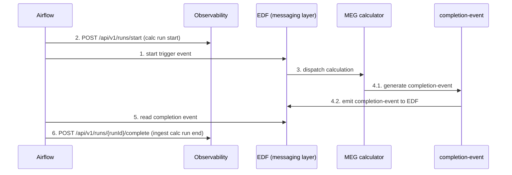

```mermaid
sequenceDiagram
  participant AF as Airflow
  participant OB as Observability
  participant EDF as EDF (messaging layer)
  participant MEG as MEG calculator
  participant CE as completion-event

  AF->>OB: 2. POST /api/v1/runs/start (calc run start)
  AF->>EDF: 1. start trigger event
  EDF->>MEG: 3. dispatch calculation
  MEG->>CE: 4.1. generate completion-event
  CE->>EDF: 4.2. emit completion-event to EDF
  AF->>EDF: 5. read completion event
  AF->>OB: 6. POST /api/v1/runs/{runId}/complete (ingest calc run end)
```