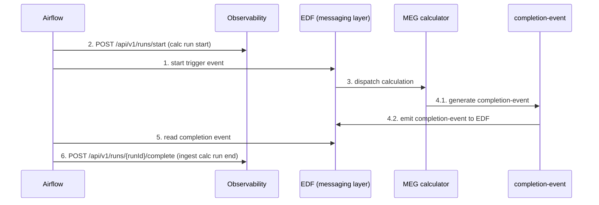

```mermaid
erDiagram
  calculator_runs {
    VARCHAR run_id PK
    DATE reporting_date PK
    VARCHAR calculator_id
    VARCHAR calculator_name
    VARCHAR tenant_id
    VARCHAR frequency
    TIMESTAMPTZ start_time
    TIMESTAMPTZ end_time
    BIGINT duration_ms
    DECIMAL start_hour_cet
    DECIMAL end_hour_cet
    VARCHAR status
    TIMESTAMPTZ sla_time
    BIGINT expected_duration_ms
    TIMESTAMPTZ estimated_start_time
    TIMESTAMPTZ estimated_end_time
    BOOLEAN sla_breached
    TEXT sla_breach_reason
    JSONB run_parameters
    JSONB additional_attributes
    TIMESTAMPTZ created_at
    TIMESTAMPTZ updated_at
  }

  calculator_run_costs {
    BIGINT run_id PK,FK
    DATE reporting_date PK
    VARCHAR frequency
    VARCHAR calculator_id
    VARCHAR calculator_name
    BIGINT databricks_run_id
    VARCHAR cluster_id
    BIGINT job_id
    VARCHAR job_name
    VARCHAR driver_node_type
    VARCHAR worker_node_type
    INTEGER worker_count
    INTEGER min_workers
    INTEGER max_workers
    NUMERIC avg_worker_count
    INTEGER peak_worker_count
    BOOLEAN spot_instances
    BOOLEAN photon_enabled
    VARCHAR spark_version
    VARCHAR runtime_engine
    VARCHAR cluster_source
    VARCHAR workload_type
    VARCHAR region
    BOOLEAN autoscale_enabled
    INTEGER autoscale_min
    INTEGER autoscale_max
    TIMESTAMP start_time
    TIMESTAMP end_time
    INTEGER duration_seconds
    NUMERIC duration_hours
    VARCHAR status
    BOOLEAN is_retry
    INTEGER attempt_number
    NUMERIC dbu_cost_usd
    NUMERIC vm_cost_usd
    NUMERIC storage_cost_usd
    NUMERIC total_cost_usd
    VARCHAR cost_calculation_status
    TIMESTAMP cost_calculated_at
    TEXT cost_calculation_notes
    VARCHAR allocation_method
    NUMERIC confidence_score
    INTEGER concurrent_runs_on_cluster
    NUMERIC cluster_utilization_pct
    VARCHAR calculation_version
    TIMESTAMP calculation_timestamp
    VARCHAR calculated_by
    NUMERIC manual_adjustment_usd
    TEXT manual_adjustment_reason
    VARCHAR adjusted_by
    TIMESTAMP adjusted_at
    VARCHAR task_version
    VARCHAR context_id
    VARCHAR tenant_abb
    TIMESTAMP collection_timestamp
    TIMESTAMP created_at
    TIMESTAMP updated_at
  }

  calculator_runs ||--|| calculator_run_costs : "run_id"
  ```