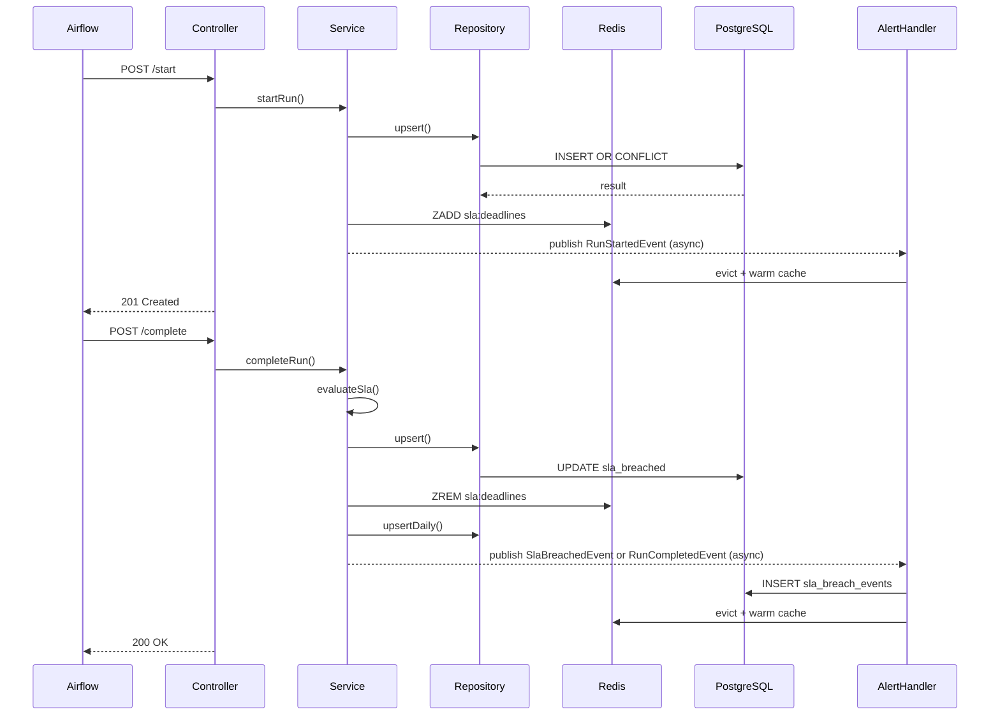

# Architecture

---

## Controller → Service → Repository Layering

```
Controller
  ├── Extracts tenantId from X-Tenant-Id header
  ├── Validates request (@Valid, @Min, @Max, @Pattern)
  ├── Records Micrometer counter
  ├── Sets Cache-Control response header
  └── Calls Projection or Service method (tenantId always passed explicitly)

Projection (service/projection/)
  ├── Cache read/write orchestration (Redis → miss → build → cache)
  ├── DTO mapping and CET formatting
  └── Delegates business logic entirely to domain Services

Service (domain)
  ├── Business logic, SLA evaluation, event publication
  ├── Calls Repository (DB) and Cache (Redis) directly
  └── Does NOT know about HTTP or presentation concerns

Repository
  ├── NamedParameterJdbcTemplate (no JPA)
  ├── Manual RowMappers
  ├── Write-through: writes to DB first, then warms Redis
  └── Read-through: checks Redis first, falls back to DB
```

### Controllers

| Controller | Path Prefix | Purpose |
|------------|-------------|---------|
| `RunIngestionController` | `/api/v1/runs` | Airflow-facing; records run start and completion |
| `RunQueryController` | `/api/v1/calculators` | Status queries, single and batch |
| `AnalyticsController` | `/api/v1/analytics` | Trend analysis, SLA summaries, and run-performance domain data |
| `ProjectionController` | `/api/v1/analytics/projections` | Formatted BFF projections: performance card, calculator dashboard, regional batch status |
| `HealthController` | `/api/v1/health` | Unauthenticated health check |

### Projection Services (`service/projection/`)

Each projection service owns exactly one response type: cache check → domain service call → DTO mapping → cache write.

| Projection | Domain Dependency | Response Type |
|-----------|------------------|--------------|
| `PerformanceCardProjection` | `AnalyticsService` | `PerformanceCardResponse` |
| `RegionalBatchProjection` ⚠️ deprecated | `RegionalBatchService`, `RegionalBatchCacheService` | `RegionalBatchStatusResponse` |
| `DashboardProjection` | `DashboardService`, `DashboardCacheService` | `CalculatorDashboardResponse` |

### Domain Services

| Service | Responsibility |
|---------|---------------|
| `RunIngestionService` | Idempotency check, SLA deadline calculation, DB upsert, SLA registration, event publication |
| `RunQueryService` | Cache-first status retrieval, batch status with pipelining |
| `AnalyticsService` | Aggregate analytics queries and cache orchestration |
| `RegionalBatchService` | Regional batch run aggregation, median estimation, dependency resolution |
| `DashboardService` | Multi-section dashboard assembly, sub-run history aggregation, dependency chain resolution |
| `SlaEvaluationService` | Synchronous SLA breach evaluation logic |
| `AlertHandlerService` | Persists breach events, sends alerts (currently log-only) |
| `CacheWarmingService` | Evicts and re-warms Redis cache after run state changes |
| `AnalyticsCacheService` | Invalidates analytics cache keys on run completion/breach |
| `CacheEvictionService` | Legacy eviction-only service (disabled by default) |

### Shared Utilities (`util/`)

| Utility | Purpose |
|---------|---------|
| `RunStatusClassifier` | Single source of truth for run status classification: `classify()`, `isSlaBreach()`, `worstStatus()`, and 5 status string constants (`ON_TIME`, `DELAYED`, `FAILED`, `RUNNING`, `NOT_STARTED`). Used by both `DashboardService` and `RegionalBatchService`. |
| `TimeUtils` | CET time conversion, SLA deadline calculation |
| `ObservabilityConstants` | Shared string constants |

### Repositories

| Repository | Table | Notes |
|------------|-------|-------|
| `CalculatorRunRepository` | `calculator_runs` | All queries include `reporting_date` for partition pruning — except `findById(String)` (TD-1) |
| `DailyAggregateRepository` | `calculator_sli_daily` | Running-average upsert on every run completion |
| `SlaBreachEventRepository` | `sla_breach_events` | Keyset pagination support; `DuplicateKeyException` guard for idempotency |

---

## Event-Driven Components

All events are synchronous Spring `ApplicationEvent`s published via `ApplicationEventPublisher`. Listeners use `@TransactionalEventListener(phase = AFTER_COMMIT)` + `@Async`, which guarantees:

1. The originating DB transaction has committed before the listener executes
2. The listener runs on the async thread pool, not the HTTP request thread

### Event Table

| Event | Published by | Listeners |
|-------|-------------|-----------|
| `RunStartedEvent` | `RunIngestionService.startRun()` | `CacheWarmingService.onRunStarted()` |
| `RunCompletedEvent` | `RunIngestionService.completeRun()` (non-breach) | `CacheWarmingService.onRunCompleted()`, `AnalyticsCacheService.onRunCompleted()`, `CacheEvictionService.onRunCompleted()` *(disabled)* |
| `SlaBreachedEvent` | `startRun()` (start breach), `completeRun()` (completion breach), `LiveSlaBreachDetectionJob` | `AlertHandlerService.handleSlaBreachEvent()`, `CacheWarmingService.onSlaBreached()`, `AnalyticsCacheService.onSlaBreached()`, `CacheEvictionService.onSlaBreached()` *(disabled)* |

### Cache Service Toggle

| Service | Property | Default | Behaviour |
|---------|----------|---------|-----------|
| `CacheWarmingService` | `observability.cache.warm-on-completion` | `true` | **Active** — evicts then re-warms Redis on run events |
| `CacheEvictionService` | `observability.cache.legacy-eviction-listener.enabled` | `false` | **Disabled** — legacy evict-only service |

---

## Scheduled Jobs

| Job Class | Method | Schedule | Purpose |
|-----------|--------|----------|---------|
| `LiveSlaBreachDetectionJob` | `detectLiveSlaBreaches()` | Every 120s, initial delay 30s | Scan Redis for overdue DAILY runs, publish `SlaBreachedEvent` |
| `LiveSlaBreachDetectionJob` | `checkEarlySlaWarnings()` | Every 180s, initial delay 30s | Warn on runs approaching SLA within 10 min |
| `PartitionManagementJob` | `createPartitions()` | Daily at 01:00 | Create partitions for next 60 days |
| `PartitionManagementJob` | `dropOldPartitions()` | Weekly Sunday at 02:00 | Drop partitions older than 395 days |
| `PartitionManagementJob` | `monitorPartitionHealth()` | Daily at 06:00 | Record partition row count gauges |

---

## Redis Interaction Model

```
Write path:
  Service writes to DB (upsert)
  → Service registers run in SlaMonitoringCache (if DAILY + not breached)
  → CacheWarmingService (async AFTER_COMMIT) evicts stale cache keys
  → CacheWarmingService warms cache by re-querying DB with findRecentRuns()

Read path:
  Repository checks Redis ZSET for recent runs
    → HIT:  deserialise and return (no DB query)
    → MISS: query DB with partition-pruned SQL
            → write result back to Redis (write-through)
            → return to caller
```

---

## Request Lifecycle — Runtime Sequence



---

## Thread Pools

| Pool | Configuration | Used by |
|------|--------------|---------|
| HTTP (Tomcat) | Default (200 max threads) | All HTTP request processing |
| Async executor | 5 core / 10 max / 100 queue, prefix `async-` | `@Async` event listeners |
| Scheduling pool | 5 threads, prefix `scheduled-` | `@Scheduled` jobs |

---

## Package Structure

```
com.company.observability
├── controller/          # REST controllers
├── service/             # Domain business logic services
│   └── projection/      # BFF projection layer (cache + DTO mapping)
├── repository/          # JDBC repositories
├── cache/               # Redis cache classes
├── domain/              # Domain objects and enums
│   └── enums/           # CalculatorFrequency, RunStatus, etc.
├── dto/
│   ├── request/         # StartRunRequest, CompleteRunRequest
│   └── response/        # RunResponse, CalculatorStatusResponse, TimeReference, etc.
├── event/               # Spring ApplicationEvents
├── scheduled/           # Scheduled jobs
├── config/              # Spring configuration classes (incl. DashboardProperties)
├── exception/           # Domain exceptions + GlobalExceptionHandler
├── security/            # RequestLoggingFilter
└── util/                # TimeUtils, RunStatusClassifier, ObservabilityConstants, etc.
```

