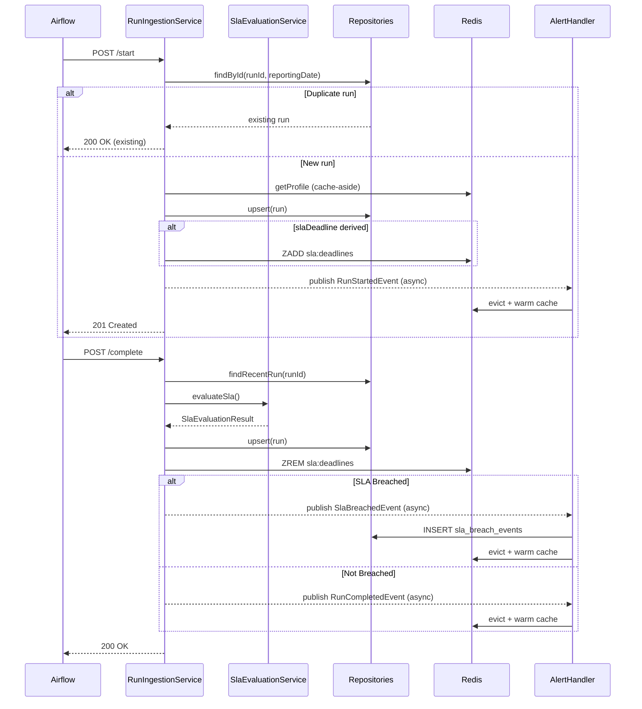

# Ingestion & Event Flow

This section documents the step-by-step execution of the two primary write operations: `startRun()` and `completeRun()`.

---

## `startRun()` — Step-by-Step

Called by `RunIngestionService.startRun()` from `POST /api/v1/runs/start`.

```
1. Idempotency check: findById(runId, reportingDate)
   → EXISTS: return existing run, increment calculator.runs.start.duplicate counter
   → DOES NOT EXIST: continue

2. MONTHLY validation:
   → Warn (non-blocking) if reportingDate is not the last day of the month

3. Fetch the cached calculator profile (Redis cache-aside, no DB on warm cache):
   profile = calculatorProfileService.getProfile(calculatorId, tenantId, frequency)

4. Resolve & freeze the SLA deadline (DAILY and MONTHLY):
   slaDeadline = slaBaselineResolver.resolveDeadline(request, frequency, profile)
   → baseline (avg duration | expectedDurationMs | slaTime budget | none)
   → slaDeadline = startTime + baseline×(1+thresholdPercent) + lateBand, or null (ungraded)
   There is NO start-time breach in the duration model.

5. Resolve estimated start/end (precedence: request → profile → computed):
   estimatedStartTime = request.estimatedStartTime
                        ?? profile avg start (anchored to start date) ?? startTime
   estimatedEndTime   = request.estimatedEndTime
                        ?? (start + expectedDurationMs) ?? (estimatedStart + profile avg duration) ?? null

6. Build CalculatorRun domain object (status = RUNNING, slaBreached = false)

7. DB write: runRepository.upsert(run)
   → INSERT ... ON CONFLICT (run_id, reporting_date) DO UPDATE
   → Only mutable fields updated on conflict (start/sla/name/estimated* are immutable)

8. SLA monitoring registration:
   Condition: liveTrackingEnabled AND slaDeadline != null   (DAILY and MONTHLY)
   slaMonitoringCache.registerForSlaMonitoring(run)
   → ZADD obs:sla:deadlines <slaEpochMs> {tenantId}:{runId}:{reportingDate}
   → HSET obs:sla:run_info {runKey} {json metadata}
   (both keys: 24h TTL)

9. publish RunStartedEvent(run)
   (async AFTER_COMMIT)
   9a. CacheWarmingService.onRunStarted():
       - evictStatusResponse() → DEL obs:status:hash:{calcId}:{tenantId}:{freq}
       - evictRecentRuns() → DEL obs:runs:zset:{calcId}:{tenantId}:{freq}
       - warmCacheForRun() → findRecentRuns(limit=20) → re-populate Redis

10. Return CalculatorRun → controller converts to RunResponse → 201 Created
```

---

## `completeRun()` — Step-by-Step

Called by `RunIngestionService.completeRun()` from `POST /api/v1/runs/{runId}/complete`.

```
1. Run lookup: findRecentRun(runId)
   a. findRecentRunsForCompletion(runId) — searches last 7 days of partitions
   b. FALLBACK (only if not found): findById(runId) — full partition scan ⚠️ TD-1

2. Tenant validation:
   run.tenantId MUST match caller's X-Tenant-Id
   → mismatch → DomainAccessDeniedException → 403 Forbidden

3. Idempotency check: status != RUNNING
   → return existing run unchanged, increment calculator.runs.complete.duplicate counter

4. Validation:
   request.endTime MUST be after run.startTime
   → violation → DomainValidationException → 400 Bad Request

5. Compute duration:
   durationMs = ChronoUnit.MILLIS.between(run.startTime, request.endTime)

6. Resolve completion status:
   RunStatus.fromCompletionStatus(request.status) → defaults to SUCCESS if null/blank

7. SLA evaluation: SlaEvaluationService.evaluateSla(run)
   Duration-band classification against the frozen slaTime:
   a. status = FAILED or TIMEOUT                       → CRITICAL breach
   b. durationMs ≤ (slaTime − startTime)               → ON_TIME (no breach)
   c. durationMs ≤ (slaTime − startTime) + bandGap     → LATE  (MEDIUM breach)
   d. otherwise                                        → VERY_LATE (HIGH breach)
   (slaTime null → ungraded → ON_TIME). Returns SlaEvaluationResult(breached, reason, severity)

8. Apply SLA result to run object:
   run.slaBreached = result.breached
   run.slaBreachReason = result.reason (multiple reasons joined with ";")
   run.endTime = endTime
   run.durationMs = durationMs
   run.endHourCet = TimeUtils.toDecimalCetHour(endTime)

9. DB write: runRepository.upsert(run)
   → INSERT ... ON CONFLICT (run_id, reporting_date) DO UPDATE
   → Updates: end_time, duration_ms, end_hour_cet, status, sla_breached, sla_breach_reason, updated_at

10. Deregister from SLA monitoring:
    slaMonitoringCache.deregisterFromSlaMonitoring(runId, tenantId, reportingDate)
    → ZREM obs:sla:deadlines {runKey}
    → HDEL obs:sla:run_info {runKey}

11. (No daily-aggregate write here.) calculator_sli_daily is rebuilt by the nightly
    DailyAggregationJob, not on each completion. See Data Architecture.

12. Publish event (async AFTER_COMMIT):
    IF sla_breached:
      → SlaBreachedEvent → AlertHandlerService + CacheWarmingService + AnalyticsCacheService
    ELSE:
      → RunCompletedEvent → CacheWarmingService + AnalyticsCacheService

    CacheWarmingService (either event):
      a. evictCacheForRun(): evict status hash + evict runs ZSET
      b. warmCacheForRun(): findRecentRuns(limit=20) → re-populate Redis

    AnalyticsCacheService:
      → Bulk delete all obs:analytics:* keys for this calculator

13. Return CalculatorRun → controller converts to RunResponse → 200 OK
```

---

## Sequence Diagram



---

## Event Listener Guarantees

All event listeners use `@TransactionalEventListener(phase = AFTER_COMMIT)` + `@Async`. This provides two critical guarantees:

1. **Durability before effect**: Cache warming and alert creation only happen after the DB transaction is committed. If the DB write fails, no stale cache or phantom alerts are created.

2. **Non-blocking HTTP thread**: Listeners execute on the `async-` thread pool, not the HTTP request thread. The caller receives their response immediately after DB commit without waiting for cache operations.

### What Happens if an Async Listener Fails?

| Failure | Consequence | Recovery |
|---------|-------------|----------|
| `CacheWarmingService` fails | Cache not refreshed; next query re-reads from DB | Automatic on next read |
| `AlertHandlerService` INSERT fails | `DuplicateKeyException` → logged, skipped. Other errors → logged | Manual or retry sweep |
| `AnalyticsCacheService` invalidation fails | Stale analytics cache until 5-min TTL expires | Automatic TTL expiry |

---

## Idempotency Matrix

| Operation | Duplicate Condition | Response | Side Effect |
|-----------|--------------------|-----------|-|
| `startRun()` | Same `(runId, reportingDate)` exists | Return existing run | `calculator.runs.start.duplicate` incremented |
| `completeRun()` | Run status is not `RUNNING` | Return existing run | `calculator.runs.complete.duplicate` incremented |
| `AlertHandlerService` INSERT | `run_id` already in `sla_breach_events` | `DuplicateKeyException` caught | `sla.breaches.duplicate` incremented |
