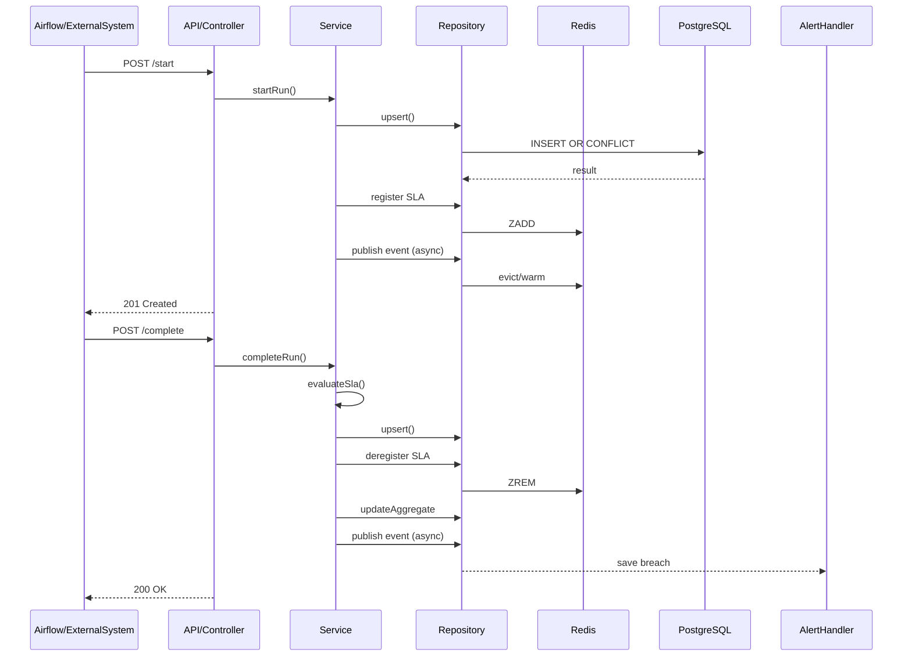
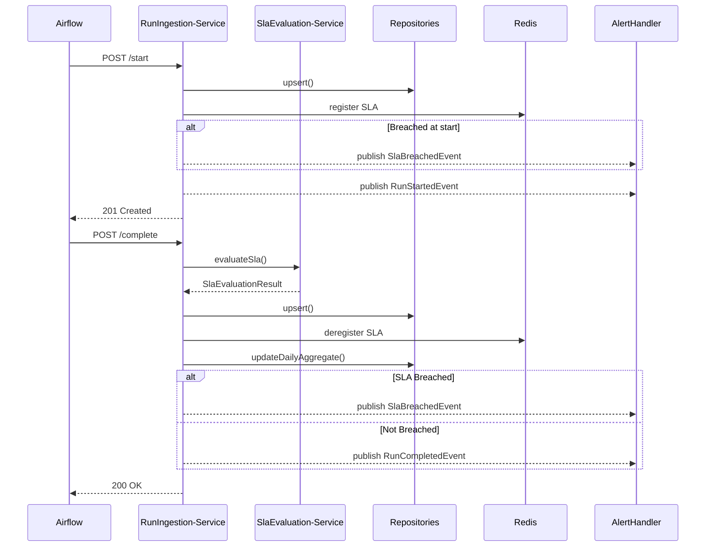

# Observability Service — Technical Specification

**Version:** 1.0
**Generated:** 2026-02-22
**Stack:** Java 17 · Spring Boot 3.5.9 · PostgreSQL 17 (Azure Flexible Server) · Redis · Flyway
**Audience:** Senior engineers, platform team, onboarding architects

---

## Table of Contents

1. [System Overview](#1-system-overview)
2. [High-Level Architecture](#2-high-level-architecture)
3. [Data Architecture](#3-data-architecture)
4. [Redis Architecture](#4-redis-architecture)
5. [API Surface](#5-api-surface)
6. [Ingestion & Event Flow](#6-ingestion--event-flow)
7. [SLA Architecture](#7-sla-architecture)
8. [Concurrency & Performance Model](#8-concurrency--performance-model)
9. [Configuration & Profiles](#9-configuration--profiles)
10. [Observability of the System](#10-observability-of-the-system)
11. [Failure Modes & Recovery](#11-failure-modes--recovery)
12. [Extension Guidelines](#12-extension-guidelines)
13. [Known Limitations & Technical Debt](#13-known-limitations--technical-debt)
14. [Open Questions](#14-open-questions)

---

## 1. System Overview

### Purpose

The Observability Service is an enterprise-grade backend that tracks the lifecycle of Apache Airflow calculator runs, monitors SLA compliance in real time, stores historical execution data, and exposes analytics APIs for trend analysis and breach reporting.

### Responsibilities

- Accept run lifecycle events from Airflow via HTTP (start / complete)
- Evaluate SLA compliance both on-write and continuously via scheduled detection
- Store all run data in a partitioned PostgreSQL table with daily granularity
- Cache status data in Redis to reduce DB read pressure
- Expose OLTP-class query endpoints for current status and batch queries
- Expose analytics endpoints for runtime trends, SLA summaries, breach detail, and performance cards
- Emit Spring application events for downstream alerting

### Architectural Style

Event-driven, layered REST service.

- **Synchronous path**: Controller → Service → Repository → DB + Redis write
- **Asynchronous path**: Spring `ApplicationEventPublisher` → `@TransactionalEventListener(AFTER_COMMIT)` + `@Async` handlers
- **Background path**: `@Scheduled` jobs for SLA monitoring and partition management

### Core Design Principles

| Principle | Implementation |
|-----------|----------------|
| No ORM | All persistence via `NamedParameterJdbcTemplate` and manual `RowMapper`s |
| Idempotency | All DB writes use `INSERT ... ON CONFLICT (run_id, reporting_date) DO UPDATE` |
| Partition safety | `reporting_date` must be included in every `calculator_runs` query |
| Multi-tenancy | `X-Tenant-Id` header on every API request; all SQL filters by `tenant_id` |
| Write-through cache | Redis is updated immediately on every write; DB is source of truth |
| Event isolation | Alert persistence runs in a new transaction after the originating transaction commits |

### Explicit Non-Goals

- No JPA / Hibernate — zero entity classes
- No distributed transactions
- No message broker (Kafka, RabbitMQ) — events are in-process Spring events only
- No user management — single in-memory Basic Auth user per deployment
- No multi-region coordination

---

### ASCII Architecture Diagram

```
┌────────────────────────────────────────────────────────────────────┐
│                          Airflow / Callers                          │
│              (HTTP Basic Auth + X-Tenant-Id header)                 │
└─────────────────────────────┬──────────────────────────────────────┘
                              │
            ┌─────────────────▼──────────────────┐
            │           Spring Boot 3.5.9         │
            │                                     │
            │  ┌──────────────────────────────┐   │
            │  │         Controllers          │   │
            │  │  RunIngestionController       │   │
            │  │  RunQueryController           │   │
            │  │  AnalyticsController          │   │
            │  │  HealthController             │   │
            │  └───────────────┬──────────────┘   │
            │                  │                   │
            │  ┌───────────────▼──────────────┐   │
            │  │           Services           │   │
            │  │  RunIngestionService          │   │
            │  │  RunQueryService              │   │
            │  │  AnalyticsService             │   │
            │  │  SlaEvaluationService         │   │
            │  │  AlertHandlerService          │   │
            │  │  CacheWarmingService          │   │
            │  └────────┬──────────┬───────────┘   │
            │           │          │               │
            │  ┌────────▼──┐  ┌───▼────────────┐  │
            │  │Repositories│  │  Redis Cache   │  │
            │  │CalculatorRun  │  RedisCalculator  │  │
            │  │ DailyAgg   │  │  Cache          │  │
            │  │ SlaBreachEv│  │  SlaMonitoring  │  │
            │  └────────┬──┘  │  Cache          │  │
            │           │     │  Analytics      │  │
            │           │     │  CacheService   │  │
            │           │     └───────┬─────────┘  │
            │  ┌────────▼──┐         │             │
            │  │PostgreSQL │◄────────┘             │
            │  │(partitioned│  (read-through        │
            │  │  by date)  │   fallback)           │
            │  └───────────┘                        │
            │                                       │
            │  ┌───────────────────────────────┐   │
            │  │      Scheduled Jobs           │   │
            │  │  LiveSlaBreachDetectionJob     │   │
            │  │  PartitionManagementJob        │   │
            │  └───────────────────────────────┘   │
            └─────────────────────────────────────┘
```

---

## 2. High-Level Architecture

### Controller → Service → Repository Layering

```
Controller
  ├── Extracts tenantId from X-Tenant-Id header
  ├── Validates request (@Valid, @Min, @Max, @Pattern)
  ├── Records Micrometer counter
  ├── Sets Cache-Control response header
  └── Calls Service method (tenantId always passed explicitly)

Service
  ├── Business logic, SLA evaluation, event publication
  ├── Calls Repository (DB) and Cache (Redis) directly
  └── Does NOT know about HTTP concerns

Repository
  ├── NamedParameterJdbcTemplate (no JPA)
  ├── Manual RowMappers
  ├── Write-through: writes to DB first, then warms Redis
  └── Read-through: checks Redis first, falls back to DB
```

### Event-Driven Components

All events are synchronous Spring `ApplicationEvent`s published via `ApplicationEventPublisher`. Listeners use `@TransactionalEventListener(phase = AFTER_COMMIT)` + `@Async` to guarantee:

1. The originating DB transaction has committed before the listener executes
2. The listener runs on the async thread pool, not the HTTP request thread

| Event | Published by | Listeners |
|-------|-------------|-----------|
| `RunStartedEvent` | `RunIngestionService.startRun()` | `CacheWarmingService.onRunStarted()` |
| `RunCompletedEvent` | `RunIngestionService.completeRun()` (non-breach) | `CacheWarmingService.onRunCompleted()`, `AnalyticsCacheService.onRunCompleted()`, `CacheEvictionService.onRunCompleted()` (disabled) |
| `SlaBreachedEvent` | `RunIngestionService.startRun()` (start-time breach), `RunIngestionService.completeRun()` (completion breach), `LiveSlaBreachDetectionJob` | `AlertHandlerService.handleSlaBreachEvent()`, `CacheWarmingService.onSlaBreached()`, `AnalyticsCacheService.onSlaBreached()`, `CacheEvictionService.onSlaBreached()` (disabled) |

**`CacheEvictionService`** is conditionally disabled (property `observability.cache.legacy-eviction-listener.enabled`, default `false`). `CacheWarmingService` is the active cache manager (property `observability.cache.warm-on-completion`, default `true`).

### Scheduled Jobs

| Job class | Method | Schedule | Purpose |
|-----------|--------|----------|---------|
| `LiveSlaBreachDetectionJob` | `detectLiveSlaBreaches()` | `fixedDelay` 120 000 ms (2 min), initial delay 30 s | Scan Redis for overdue DAILY runs, publish `SlaBreachedEvent` |
| `LiveSlaBreachDetectionJob` | `checkEarlySlaWarnings()` | `fixedDelay` 180 000 ms (3 min), initial delay 30 s | Warn on runs approaching SLA deadline within 10 min |
| `PartitionManagementJob` | `createPartitions()` | Daily at 01:00 | Create partitions for next 60 days |
| `PartitionManagementJob` | `dropOldPartitions()` | Weekly Sunday at 02:00 | Drop partitions older than 395 days |
| `PartitionManagementJob` | `monitorPartitionHealth()` | Daily at 06:00 | Record partition row count gauges |

### Redis Interaction Model

```
Write path:
  Service writes to DB (upsert)
  → Service registers run in SlaMonitoringCache (if DAILY + not breached)
  → CacheWarmingService (async AFTER_COMMIT) evicts stale cache keys
  → CacheWarmingService warms cache by re-querying DB with findRecentRuns()

Read path:
  Repository checks Redis ZSET for recent runs
    → HIT: deserialise and return (no DB query)
    → MISS: query DB with partition-pruned SQL
          → write result back to Redis (write-through)
          → return to caller
```

---

### Runtime Interaction Diagram




---

## 3. Data Architecture

### 3.1 PostgreSQL

#### Table: `calculator_runs` (partitioned)

```sql
CREATE TABLE calculator_runs (
    run_id                VARCHAR(100)   NOT NULL,
    calculator_id         VARCHAR(100)   NOT NULL,
    calculator_name       VARCHAR(255)   NOT NULL,
    tenant_id             VARCHAR(50)    NOT NULL,
    frequency             VARCHAR(20)    NOT NULL,       -- 'DAILY' or 'MONTHLY'
    reporting_date        DATE           NOT NULL,       -- PARTITION KEY
    start_time            TIMESTAMPTZ    NOT NULL,
    end_time              TIMESTAMPTZ,
    duration_ms           BIGINT,
    start_hour_cet        DECIMAL(4,2),                 -- pre-computed, e.g. 06.25 = 06:15 CET
    end_hour_cet          DECIMAL(4,2),
    status                VARCHAR(20)    NOT NULL,       -- RUNNING/SUCCESS/FAILED/TIMEOUT/CANCELLED
    sla_time              TIMESTAMPTZ,
    expected_duration_ms  BIGINT,
    estimated_start_time  TIMESTAMPTZ,
    estimated_end_time    TIMESTAMPTZ,
    sla_breached          BOOLEAN        DEFAULT false,
    sla_breach_reason     TEXT,
    run_parameters        JSONB,
    additional_attributes JSONB,
    created_at            TIMESTAMPTZ    NOT NULL DEFAULT NOW(),
    updated_at            TIMESTAMPTZ    NOT NULL DEFAULT NOW(),
    PRIMARY KEY (run_id, reporting_date)
) PARTITION BY RANGE (reporting_date);
```

**Key design notes:**
- All timestamps stored as `TIMESTAMPTZ` (UTC). CET values (`start_hour_cet`, `end_hour_cet`) are pre-computed via `TimeUtils` and stored as `DECIMAL(4,2)` to avoid CET conversion at query time.
- `run_parameters` and `additional_attributes` are untyped JSONB — no PostgreSQL CHECK constraint on their structure.
- No foreign key constraints (partitioned tables cannot have inbound FK references).
- No CHECK constraint on `status` or `frequency` columns — only the Java layer enforces enum membership.
- Columns `calculator_name`, `start_time`, `start_hour_cet`, `sla_time`, `expected_duration_ms`, `estimated_start_time`, `estimated_end_time` are **immutable after first INSERT** — the ON CONFLICT UPDATE clause deliberately omits them.

#### Table: `calculator_sli_daily`

```sql
CREATE TABLE calculator_sli_daily (
    calculator_id     VARCHAR(100)  NOT NULL,
    tenant_id         VARCHAR(50)   NOT NULL,
    day_cet           DATE          NOT NULL,
    total_runs        INT           DEFAULT 0,
    success_runs      INT           DEFAULT 0,
    sla_breaches      INT           DEFAULT 0,
    avg_duration_ms   BIGINT        DEFAULT 0,
    avg_start_min_cet INT           DEFAULT 0,   -- minutes since midnight CET, 0-1439
    avg_end_min_cet   INT           DEFAULT 0,
    computed_at       TIMESTAMPTZ   NOT NULL DEFAULT NOW(),
    PRIMARY KEY (calculator_id, tenant_id, day_cet)
);
```

Not partitioned. Aggregates are computed incrementally via running-average upsert on every run completion. `day_cet` is the CET calendar day (not UTC).

#### Table: `sla_breach_events`

```sql
CREATE TABLE sla_breach_events (
    breach_id       BIGSERIAL PRIMARY KEY,
    run_id          VARCHAR(100)  NOT NULL UNIQUE,   -- idempotency: one record per run
    calculator_id   VARCHAR(100)  NOT NULL,
    calculator_name VARCHAR(255)  NOT NULL,
    tenant_id       VARCHAR(50)   NOT NULL,
    breach_type     VARCHAR(50)   NOT NULL,
    expected_value  BIGINT,
    actual_value    BIGINT,
    severity        VARCHAR(20)   NOT NULL
                    CHECK (severity IN ('LOW','MEDIUM','HIGH','CRITICAL')),
    alerted         BOOLEAN       DEFAULT false,
    alerted_at      TIMESTAMPTZ,
    alert_status    VARCHAR(20)   DEFAULT 'PENDING'
                    CHECK (alert_status IN ('PENDING','SENT','FAILED','RETRYING')),
    retry_count     INT           DEFAULT 0,
    last_error      TEXT,
    created_at      TIMESTAMPTZ   NOT NULL DEFAULT NOW()
);
```

`UNIQUE (run_id)` acts as the idempotency key — `AlertHandlerService` catches `DuplicateKeyException` on duplicate breach events.

#### Partitioning Model

- **Strategy**: `RANGE` on `reporting_date` (DATE)
- **Granularity**: One partition per calendar day, e.g., `calculator_runs_2026_02_22`
- **Partition bounds**: `FOR VALUES FROM ('YYYY-MM-DD') TO ('YYYY-MM-DD+1')` (exclusive upper bound)
- **At migration time** (V4): `create_calculator_run_partitions()` is called immediately, creating ~62 initial partitions (yesterday + today + 60 future days)
- **Runtime creation**: `PartitionManagementJob.createPartitions()` runs daily at 01:00 to maintain a 60-day forward window
- **Retention**: `drop_old_calculator_run_partitions()` drops partitions older than 395 days (Sunday weekly)

#### Composite Primary Key

`PRIMARY KEY (run_id, reporting_date)` — both components are mandatory. The ON CONFLICT clause targets `(run_id, reporting_date)`. Any query that omits `reporting_date` from the WHERE clause will scan every partition.

#### Indexing Strategy

| Index name | Table | Columns | Type | Purpose |
|-----------|-------|---------|------|---------|
| `calculator_runs_lookup_idx` | `calculator_runs` | `(calculator_id, tenant_id, reporting_date DESC, created_at DESC)` | BTREE | Single-calculator status queries |
| `calculator_runs_tenant_idx` | `calculator_runs` | `(tenant_id, reporting_date DESC)` | BTREE | Tenant-level scans |
| `calculator_runs_status_idx` | `calculator_runs` | `(status, reporting_date DESC) WHERE status='RUNNING'` | BTREE (partial) | Active run queries |
| `calculator_runs_sla_idx` | `calculator_runs` | `(sla_time, status) WHERE status='RUNNING' AND sla_time IS NOT NULL` | BTREE (partial) | SLA deadline queries |
| `calculator_runs_frequency_idx` | `calculator_runs` | `(frequency, reporting_date DESC)` | BTREE | Frequency-specific scans |
| `calculator_runs_tenant_calculator_frequency_idx` | `calculator_runs` | `(tenant_id, calculator_id, frequency, reporting_date DESC, created_at DESC)` | BTREE | Batch status queries (V12) |
| `idx_calculator_sli_daily_recent` | `calculator_sli_daily` | `(calculator_id, tenant_id, day_cet DESC)` | BTREE | Recent aggregates queries |
| `sla_breach_events_tenant_calculator_created_idx` | `sla_breach_events` | `(tenant_id, calculator_id, created_at DESC, breach_id DESC)` | BTREE | Keyset pagination without severity |
| `sla_breach_events_tenant_calculator_severity_created_idx` | `sla_breach_events` | `(tenant_id, calculator_id, severity, created_at DESC, breach_id DESC)` | BTREE | Keyset pagination with severity |
| `idx_sla_breach_events_unalerted` | `sla_breach_events` | `(created_at) WHERE alerted=false` | BTREE (partial) | Alert retry queries |
| `idx_sla_breach_events_calculator` | `sla_breach_events` | `(calculator_id, created_at DESC)` | BTREE | Breach history by calculator |

All indexes are created on the parent partitioned table; PostgreSQL propagates them to each child partition automatically. V3 and V12 migrations use `-- flyway:transactional=false` to allow `CREATE INDEX` on partitioned tables.

#### Query Window Logic

| Frequency | WHERE clause on `reporting_date` | Partition coverage |
|-----------|----------------------------------|-------------------|
| `DAILY` | `>= CURRENT_DATE - INTERVAL '3 days' AND <= CURRENT_DATE` | 4 partitions maximum |
| `MONTHLY` | `>= CURRENT_DATE - INTERVAL '13 months'` (plus end-of-month row filter) | ~395 partitions scanned (see §3.2) |

Analytics queries use a dynamic window: `>= CURRENT_DATE - CAST(? AS INTEGER) * INTERVAL '1 day'`, bounding at the caller-specified `days` parameter (1–365).

---

### 3.2 Partition Safety Audit

> **Rule**: Every query against `calculator_runs` MUST include a `reporting_date` predicate that the PostgreSQL planner can evaluate at plan time to enable constraint exclusion. Missing or non-constant `reporting_date` predicates result in a full partition scan.

#### Audit Table — All Repository Queries

| Method | Table | WHERE clause (summary) | `reporting_date` in WHERE? | Partition pruning? | Risk |
|--------|-------|------------------------|----------------------------|--------------------|------|
| `findRecentRuns()` → DAILY | `calculator_runs` | `calcId=? AND tenantId=? AND freq=? AND rd >= NOW-3d AND rd <= NOW` | YES — bounded constant range | **YES** | None |
| `findRecentRuns()` → MONTHLY | `calculator_runs` | `calcId=? AND tenantId=? AND freq=? AND rd = (end-of-month expr) AND rd >= NOW-13mo` | YES — lower bound constant | **PARTIAL** | Medium |
| `queryBatchFromDatabase()` → DAILY | `calculator_runs` | `calcId IN(?) AND tenantId=? AND freq=? AND rd >= NOW-3d AND rd <= NOW` | YES — bounded constant range | **YES** | None |
| `queryBatchFromDatabase()` → MONTHLY | `calculator_runs` | `calcId IN(?) AND tenantId=? AND freq=? AND rd = (end-of-month expr) AND rd >= NOW-13mo` | YES — lower bound constant | **PARTIAL** | Medium |
| `upsert()` | `calculator_runs` | INSERT — `reporting_date` in VALUES | YES — exact value in INSERT | **YES** — partition routing | None |
| `findById(String, LocalDate)` | `calculator_runs` | `run_id=? AND reporting_date=?` | YES — exact constant | **YES** | None |
| `findById(String)` ⚠️ | `calculator_runs` | `run_id=?` | **NO** | **NO** — full scan | **HIGH** |
| `markSlaBreached(runId, reason, date)` | `calculator_runs` | `run_id=? AND reporting_date=? AND status='RUNNING' AND sla_breached=false` | YES — exact constant | **YES** | None |
| `countRunning()` (DB fallback) | `calculator_runs` | `status='RUNNING' AND rd >= NOW-7d` | YES — 7-day window | **YES** | None |
| `findRunsWithSlaStatus()` | `calculator_runs` | `calcId=? AND tenantId=? AND freq=? AND rd >= NOW-Nd AND rd <= NOW` | YES — dynamic but bounded | **YES** | None |
| `recent_daily_runs` view | `calculator_runs` | `freq='DAILY' AND rd >= NOW-3d AND rd <= NOW` | YES | **YES** | None |
| `recent_monthly_runs` view | `calculator_runs` | `freq='MONTHLY' AND rd=(end-of-month) AND rd >= NOW-13mo` | YES — lower bound | **PARTIAL** | Medium |
| `active_calculator_runs` view | `calculator_runs` | `status='RUNNING' AND rd >= NOW-7d` | YES | **YES** | None |
| `getPartitionStatistics()` | pg_class (metadata) | N/A | N/A | N/A | None |

#### Violation Detail

**`findById(String runId)` — HIGH RISK**

```sql
SELECT ... FROM calculator_runs WHERE run_id = ? ORDER BY reporting_date DESC LIMIT 1
```

No `reporting_date` predicate. PostgreSQL must query every child partition. With 60 future + ~395 historical partitions, this executes ~455 index range scans joined via Append. Expected impact: 20–100x slower than `findById(String, LocalDate)` depending on partition count and data distribution.

This method exists as a last-resort fallback in `RunIngestionService.findRecentRun()` — it is only called when the 7-day recent-run search returns nothing. The code documents the risk with a warning comment.

**MONTHLY partition pruning — MEDIUM RISK**

The expression `reporting_date = (DATE_TRUNC('month', reporting_date) + INTERVAL '1 month - 1 day')::DATE` is a self-referential row-level filter. PostgreSQL cannot evaluate it at plan time to exclude partitions; it is applied per-row after the lower-bound constraint exclusion (`>= NOW-13mo`) narrows the scan to ~395 partitions. Within those 395 partitions, every partition is scanned. This is structurally unavoidable with the current partitioning design.

**Quantified impact:**
- DAILY query: 4 partitions → plan time O(1), negligible overhead
- MONTHLY query: ~395 partitions scanned → planner overhead plus per-partition index scan; typically adds 50–200ms vs a DAILY query with equivalent data volume
- `findById(String)` with no date: ~455 partitions → adds 200–500ms in a cold scenario; potentially seconds under high partition fragmentation

---

## 4. Redis Architecture

### Key Pattern Reference

| Key Pattern | Data Structure | TTL | Purpose |
|------------|----------------|-----|---------|
| `obs:runs:zset:{calcId}:{tenantId}:{frequency}` | ZSET | 5m (RUNNING) / 15m (completed <30m ago) / 1h (DAILY older) / 4h (MONTHLY older) | Recent run objects, scored by `createdAt.toEpochMilli()`, capped at 100 members |
| `obs:status:hash:{calcId}:{tenantId}:{frequency}` | Hash | 30s (RUNNING current) / 60s (completed) | `CalculatorStatusResponse` objects, keyed by `historyLimit` integer |
| `obs:running` | Set | 2h | Members = `{calcId}:{tenantId}:{frequency}` — tracks all currently RUNNING runs. Written by `cacheRunOnWrite()`: SADD on RUNNING, SREM on completion. |
| `obs:active:bloom` | Set | 24h | Simulated bloom filter — set of calculator IDs seen in last 24h |
| `obs:sla:deadlines` | ZSET | 24h | Member = `{tenantId}:{runId}:{reportingDate}`, score = SLA deadline epoch ms |
| `obs:sla:run_info` | Hash | 24h | Field = runKey, value = JSON `{runId, calcId, tenantId, reportingDate, startTime, slaTime}` |
| `obs:analytics:{prefix}:{calcId}:{tenantId}:{days}` | String (JSON) | 5m | Analytics responses without frequency |
| `obs:analytics:{prefix}:{calcId}:{tenantId}:{freq}:{days}` | String (JSON) | 5m | Analytics responses with frequency |
| `obs:analytics:index:{calcId}:{tenantId}` | Set | 1h | Tracks all analytics keys for bulk invalidation |

### Key Details per Structure

#### `obs:runs:zset` — Run ZSET

**Write path:** `RedisCalculatorCache.cacheRunOnWrite()` — adds run object serialized as JSON, scored by `createdAt` epoch ms. Trims to last 100 members. TTL is set based on run state at write time:
- Status = RUNNING → 5 minutes
- Completed < 30 minutes ago → 15 minutes
- Completed DAILY → 1 hour
- Completed MONTHLY → 4 hours

**Read path:** `getRecentRuns()` — `ZREVRANGE 0 limit-1`. Returns `Optional.empty()` on miss (key absent or deserialization failure).

**Update path:** `updateRunInCache()` — removes the old version by member, re-adds updated version at the same score. Does **not** reset the TTL.

**Eviction:** `evictRecentRuns()` — `DEL` on the entire key. Called by `CacheWarmingService` on run start/complete events.

#### `obs:status:hash` — Status Response Cache

**Write path:** `cacheStatusResponse()` — `HSET hash historyLimit responseObject` + `EXPIRE`. TTL: 30s if the current run is RUNNING, else 60s. Batch variant uses Redis pipelining for efficiency.

**Read path:** `getStatusResponse()` — `HGET hash historyLimit`. Returns `Optional.empty()` on miss.

**Eviction:** `evictStatusResponse()` — `DEL` on the entire hash (evicts all historyLimit variants at once). Called after run state transitions.

#### `obs:sla:deadlines` + `obs:sla:run_info` — SLA Monitoring

**Write path:** On `startRun()`, if frequency=DAILY and slaTime != null and not already breached: `ZADD obs:sla:deadlines slaEpochMs runKey` + `HSET obs:sla:run_info runKey runInfoJson`. Both keys expire in 24h.

**Read path (detection):** `ZRANGEBYSCORE obs:sla:deadlines 0 nowEpochMs` → returns all run keys with deadline ≤ now. For each key, `HGET obs:sla:run_info runKey` to get run metadata.

**Read path (early warning):** `ZRANGEBYSCORE obs:sla:deadlines nowEpochMs (nowEpochMs + 10min*60000)` — returns approaching runs.

**Eviction:** `ZREM obs:sla:deadlines runKey` + `HDEL obs:sla:run_info runKey` — called on run completion and after breach is confirmed.

#### `obs:active:bloom` — Simulated Bloom Filter

A plain Redis Set used as a lightweight calculator-ID existence check before expensive DB queries. `SADD calculatorId` on write, `SISMEMBER` on read. 24h TTL. False positives are impossible (it is a true set), but the set may contain stale IDs after TTL expiry.

### Source-of-Truth Hierarchy

```
PostgreSQL → Redis (write-through)
         ↑
         └── Redis miss → DB query → re-populate Redis
```

PostgreSQL is always the authoritative source. Redis is a read-accelerator. On any Redis failure, all reads fall back to PostgreSQL transparently. On any Redis write failure, the error is logged and the system continues (writes are non-blocking best-effort after the DB commit).

### Serialization

All values use `Jackson2JsonRedisSerializer<Object>` with:
- `JavaTimeModule` enabled (ISO-8601 timestamps)
- `WRITE_DATES_AS_TIMESTAMPS` disabled
- `FAIL_ON_UNKNOWN_PROPERTIES` disabled
- `DefaultTyping.NON_FINAL` with polymorphic type validation (type information embedded in JSON for correct deserialization)

Keys use `StringRedisSerializer`.

### Consistency Guarantees

| Scenario | Behavior |
|----------|----------|
| Redis write fails after DB commit | Cache miss on next read; DB is queried. No data loss. |
| Redis stale after crash/restart | All keys have TTLs; data is rebuilt on cache miss |
| Concurrent writes to same run | `updateRunInCache()` is not atomic (ZREM + ZADD). A concurrent read between the two ops will see a missing entry and fall back to DB |
| Status hash eviction on state change | Whole hash deleted; next read re-populates from DB |

---

## 5. API Surface

### Authentication & Headers

All endpoints except `/api/v1/health`, `/v3/api-docs/**`, `/swagger-ui/**` require:

- **Authorization**: HTTP Basic (`admin:admin` by default; configurable via `OBS_BASIC_USER` / `OBS_BASIC_PASSWORD`)
- **X-Tenant-Id**: String (required header; Spring returns 400 if absent)

### Error Response Format

```json
{
  "timestamp": "2026-02-22T10:30:00Z",
  "status": 400,
  "error": "Bad Request",
  "message": "<exception message>"
}
```

Validation errors (field-level):
```json
{
  "timestamp": "2026-02-22T10:30:00Z",
  "status": 400,
  "error": "Validation Failed",
  "errors": { "fieldName": "constraint message" }
}
```

---

### 5.1 Ingestion Endpoints

#### `POST /api/v1/runs/start`

**Purpose:** Record a calculator run start event from Airflow.

**Request body** (`StartRunRequest`, all fields required unless noted):

| Field | Type | Constraints | Notes |
|-------|------|-------------|-------|
| `runId` | String | `@NotBlank` | Must be globally unique per tenant |
| `calculatorId` | String | `@NotBlank` | |
| `calculatorName` | String | `@NotBlank` | Immutable after first insert |
| `frequency` | CalculatorFrequency | `@NotNull` | `DAILY`/`D` or `MONTHLY`/`M` |
| `reportingDate` | LocalDate | `@NotNull` | Partition key — must always be provided |
| `startTime` | Instant | `@NotNull` | UTC; example: `2026-02-06T23:22:32Z` |
| `slaTimeCet` | LocalTime | `@NotNull` | CET time-of-day for SLA deadline; example: `06:15:00` |
| `expectedDurationMs` | Long | optional | Used for >150% duration breach detection |
| `estimatedStartTimeCet` | LocalTime | optional | |
| `runParameters` | Map\<String,Object\> | optional | Stored as JSONB |
| `additionalAttributes` | Map\<String,Object\> | optional | Stored as JSONB |

**Response:** `201 Created` + `Location: /api/v1/runs/{runId}` header

```json
{
  "runId": "run-abc-123",
  "calculatorId": "calc-1",
  "calculatorName": "My Calculator",
  "status": "RUNNING",
  "startTime": "2026-02-06T23:22:32Z",
  "endTime": null,
  "durationMs": null,
  "slaBreached": false,
  "slaBreachReason": null
}
```

**Idempotency:** Duplicate `(runId, reportingDate)` returns the existing run immediately. Counter `calculator.runs.start.duplicate` incremented.

**Classification:** OLTP-safe. Single upsert + 2 Redis ops.

---

#### `POST /api/v1/runs/{runId}/complete`

**Purpose:** Record run completion. Triggers SLA evaluation.

**Path variable:** `runId` (String)

**Request body** (`CompleteRunRequest`):

| Field | Type | Constraints | Notes |
|-------|------|-------------|-------|
| `endTime` | Instant | `@NotNull` | Must be after `startTime`; validated in service |
| `status` | String | optional, `@Pattern(SUCCES\|FAILED\|TIMEOUT\|CANCELLED)` | Defaults to `SUCCESS` if null/blank |

**Response:** `200 OK` with `RunResponse` (same structure as start; `endTime`, `durationMs`, `slaBreached`, `slaBreachReason` populated).

**SLA evaluation:** Runs synchronously in the request thread before DB write. Results stored in the upserted row.

**Classification:** OLTP-safe. Single upsert + SLA eval + 3 Redis ops + daily aggregate upsert.

---

### 5.2 Query Endpoints

#### `GET /api/v1/calculators/{calculatorId}/status`

**Purpose:** Get current status and recent history for one calculator.

**Query parameters:**

| Name | Type | Default | Constraints | Notes |
|------|------|---------|-------------|-------|
| `frequency` | String | required | `DAILY`/`D`/`MONTHLY`/`M` | |
| `historyLimit` | int | `5` | `@Min(1) @Max(100)` | Number of historical runs returned |
| `bypassCache` | boolean | `false` | | Forces fresh DB query |

**Response:** `200 OK`, `Cache-Control: max-age=30, private` (or `no-cache` if `bypassCache=true`)

```json
{
  "calculatorName": "My Calculator",
  "lastRefreshed": "2026-02-22T10:30:00Z",
  "current": { "runId": "...", "status": "RUNNING", "start": "...", "sla": "...", ... },
  "history": [ { ... }, { ... } ]
}
```

**Cache behavior:** Redis hash `obs:status:hash:{calcId}:{tenantId}:{freq}` keyed by `historyLimit`. Miss → DB query with partition-pruned window.

**Classification:** OLTP-safe. O(historyLimit) rows from at most 4 partitions (DAILY) or ~395 (MONTHLY).

---

#### `POST /api/v1/calculators/batch/status`

**Purpose:** Get status for multiple calculators in a single request.

**Request body:** `List<String> calculatorIds` — `@NotEmpty @Size(max=100)`

**Query parameters:**

| Name | Type | Default | Constraints |
|------|------|---------|-------------|
| `frequency` | String | required | Same as above |
| `historyLimit` | int | `5` | `@Min(1) @Max(50)` |
| `allowStale` | boolean | `true` | `false` forces DB for all |

**Response:** `200 OK`, `Cache-Control: max-age=60, private` (or `no-cache` if `allowStale=false`). List of `CalculatorStatusResponse`.

**Cache behavior:** Redis pipeline multi-hGet for all calculator IDs. DB query (with `ROW_NUMBER()` window function) issued only for misses.

**Classification:** OLTP-safe for small batches (≤20). Borderline for batches of 100 with `allowStale=false` and no cache — triggers one window-function query across 4 partitions for up to 100 calculator IDs.

---

### 5.3 Analytics Endpoints

All analytics endpoints require the same auth headers. All return `Cache-Control: max-age=60, private` except SLA breaches detail which is `no-cache`.

#### `GET /api/v1/analytics/calculators/{calculatorId}/runtime`

**Purpose:** Average runtime statistics over a lookback period.

**Query parameters:**

| Name | Type | Default | Constraints |
|------|------|---------|-------------|
| `days` | int | required | `@Min(1) @Max(365)` |
| `frequency` | String | `DAILY` | `DAILY` or `MONTHLY` |

**Data source:** `calculator_sli_daily` (pre-aggregated). One `DailyAggregate` row per day.

**Aggregation logic:**
- Weighted average duration: `Σ(avg_duration * total_runs) / Σ(total_runs)`
- Min/max extracted from daily rows
- Success rate: `Σ(success_runs) / Σ(total_runs)`

**Response:**
```json
{
  "calculatorId": "calc-1",
  "periodDays": 30,
  "frequency": "DAILY",
  "avgDurationMs": 8100000,
  "avgDurationFormatted": "2hrs 15mins",
  "minDurationMs": 6000000,
  "maxDurationMs": 12000000,
  "totalRuns": 28,
  "successRate": 0.96,
  "dataPoints": [
    { "date": "2026-02-22", "avgDurationMs": 8100000, "totalRuns": 1, "successRuns": 1 }
  ]
}
```

**SQL (simplified):**
```sql
SELECT * FROM calculator_sli_daily
WHERE calculator_id = ? AND tenant_id = ?
AND day_cet >= CURRENT_DATE - CAST(? AS INTEGER) * INTERVAL '1 day'
ORDER BY day_cet DESC
```

**Partition safety:** `calculator_sli_daily` is not partitioned — no partition concern.
**Cache:** `obs:analytics:runtime:{calcId}:{tenantId}:{freq}:{days}` — 5-minute TTL.
**Classification:** OLTP-safe. Reads from pre-aggregated table; cost = O(days) rows.

---

#### `GET /api/v1/analytics/calculators/{calculatorId}/sla-summary`

**Purpose:** SLA breach count breakdown by severity and day-color classification (GREEN/AMBER/RED).

**Query parameters:** `days` (`@Min(1) @Max(365)`)

**Data sources:**
- `calculator_sli_daily` — daily aggregate with `sla_breaches` count
- `sla_breach_events` — detailed breach records for severity breakdown

**Response:**
```json
{
  "calculatorId": "calc-1",
  "periodDays": 30,
  "totalBreaches": 5,
  "greenDays": 25,
  "amberDays": 4,
  "redDays": 1,
  "breachesBySeverity": { "LOW": 2, "MEDIUM": 1, "HIGH": 1, "CRITICAL": 1 },
  "breachesByType": { "END_TIME_EXCEEDED": 3, "DURATION_EXCEEDED": 1, "RUN_FAILED": 1 }
}
```

**Day classification logic:**
- GREEN: no SLA breaches on that day
- RED: at least one breach with severity `HIGH` or `CRITICAL`
- AMBER: breaches exist but none are `HIGH`/`CRITICAL`

**SQL (sla_breach_events query):**
```sql
SELECT ... FROM sla_breach_events
WHERE calculator_id = ? AND tenant_id = ?
AND created_at >= NOW() - CAST(? AS INTEGER) * INTERVAL '1 day'
ORDER BY created_at DESC
```

**Cache:** `obs:analytics:sla-summary:{calcId}:{tenantId}:{days}` — 5-minute TTL.
**Classification:** OLTP-safe. O(days) rows from each table. Two queries, no joins.

---

#### `GET /api/v1/analytics/calculators/{calculatorId}/trends`

**Purpose:** Per-day trend data including run counts, durations, breach counts, and CET timing.

**Query parameters:** `days` (`@Min(1) @Max(365)`)

**Data source:** `calculator_sli_daily`

**Response:**
```json
{
  "calculatorId": "calc-1",
  "periodDays": 30,
  "trends": [
    {
      "date": "2026-02-22",
      "avgDurationMs": 8100000,
      "totalRuns": 1,
      "successRuns": 1,
      "slaBreaches": 0,
      "avgStartMinCet": 360,
      "avgEndMinCet": 495,
      "slaStatus": "GREEN"
    }
  ]
}
```

**Per-day SLA status:** GREEN if `sla_breaches == 0`; otherwise classified by worst severity from `buildSlaSummaryResponse()`.

**Cache:** `obs:analytics:trends:{calcId}:{tenantId}:{days}` — 5-minute TTL.
**Classification:** OLTP-safe. O(days) rows.

---

#### `GET /api/v1/analytics/calculators/{calculatorId}/sla-breaches`

**Purpose:** Paginated detailed breach event log.

**Query parameters:**

| Name | Type | Default | Constraints |
|------|------|---------|-------------|
| `days` | int | required | `@Min(1) @Max(365)` |
| `severity` | String | optional | `LOW`/`MEDIUM`/`HIGH`/`CRITICAL` |
| `page` | int | `0` | `@Min(0)` — offset mode |
| `cursor` | String | optional | Opaque Base64 cursor for keyset mode |
| `size` | int | `20` | `@Min(1) @Max(100)` |

**Pagination modes:**
- **Cursor-based (keyset):** When `cursor` is provided. Decodes to `(createdAt, breachId)` pair. Uses `AND (created_at, breach_id) < (?, ?)` for efficient cursor traversal. Requires indexes `sla_breach_events_tenant_calculator_created_idx` / `sla_breach_events_tenant_calculator_severity_created_idx`.
- **Offset-based:** When `cursor=null` (for legacy compatibility). `LIMIT ? OFFSET ?`. Becomes expensive on large pages.

**Response:**
```json
{
  "content": [
    {
      "breachId": 42,
      "runId": "run-abc-123",
      "calculatorId": "calc-1",
      "calculatorName": "My Calculator",
      "breachType": "END_TIME_EXCEEDED",
      "severity": "HIGH",
      "slaStatus": "RED",
      "expectedValue": 1706220000,
      "actualValue": 1706224200,
      "createdAt": "2026-01-25T14:15:00Z"
    }
  ],
  "page": 0,
  "size": 20,
  "totalElements": 42,
  "totalPages": 3,
  "nextCursor": "MjAyNi0wMS0yNVQxNDoxNTowMFo6NDI="
}
```

**Cache:** None — `Cache-Control: no-cache`. Fresh data always.
**Classification:** OLTP-safe with cursor pagination. Offset pagination becomes OLAP-like (full index scan to page position) for `page > 50` with large `days` values.

**Worst case:** `days=365, page=100, size=100, severity=null` without a cursor → scans ~36,500 rows in memory to reach offset 10,000. Avoid large offset pagination in production.

---

#### `GET /api/v1/analytics/calculators/{calculatorId}/performance-card`

**Purpose:** Composite dashboard payload — schedule info, SLA percentages, mean duration, per-run bars for chart rendering, and reference lines.

**Query parameters:**

| Name | Type | Default | Constraints |
|------|------|---------|-------------|
| `days` | int | `30` | `@Min(1) @Max(365)` |
| `frequency` | String | `DAILY` | `DAILY` or `MONTHLY` |

**Data source:** `calculator_runs` LEFT JOIN `sla_breach_events` via `findRunsWithSlaStatus()`.

**SQL:**
```sql
SELECT cr.*, sbe.severity
FROM calculator_runs cr
LEFT JOIN sla_breach_events sbe ON sbe.run_id = cr.run_id
WHERE cr.calculator_id = ? AND cr.tenant_id = ? AND cr.frequency = ?
AND cr.reporting_date >= CURRENT_DATE - CAST(? AS INTEGER) * INTERVAL '1 day'
AND cr.reporting_date <= CURRENT_DATE
ORDER BY cr.reporting_date ASC, cr.created_at ASC
```

**Per-run SLA classification:**
- `SLA_MET`: not breached
- `LATE`: breached, severity LOW or MEDIUM
- `VERY_LATE`: breached, severity HIGH or CRITICAL

**SLA percentage invariant:** `slaMetPct + latePct + veryLatePct = 100.0`

**Response (abbreviated):**
```json
{
  "calculatorId": "calc-1",
  "calculatorName": "My Calculator",
  "schedule": { "estimatedStartTimeCet": "10:00", "frequency": "DAILY" },
  "periodDays": 30,
  "meanDurationMs": 8100000,
  "meanDurationFormatted": "2hrs 15mins",
  "slaSummary": { "totalRuns": 28, "slaMetCount": 24, "slaMetPct": 85.7, "lateCount": 3, "latePct": 10.7, "veryLateCount": 1, "veryLatePct": 3.6 },
  "runs": [
    { "runId": "...", "reportingDate": "2026-01-24", "startHourCet": 10.12, "endHourCet": 12.25, "slaStatus": "SLA_MET", ... }
  ],
  "referenceLines": { "slaStartHourCet": 10.0, "slaEndHourCet": 12.0 }
}
```

**Cache:** `obs:analytics:performance-card:{calcId}:{tenantId}:{freq}:{days}` — 5-minute TTL.
**Classification:** OLTP-safe for `days <= 90`. Borderline for `days=365` — returns up to 365 rows, each with a LEFT JOIN to `sla_breach_events`. The JOIN is on `run_id` (unique on `sla_breach_events`) — effectively O(n) with n = run count.

---

### OpenAPI Contract Summary

Base URL: `http://localhost:8080`
API docs: `GET /api-docs`
Swagger UI: `GET /swagger-ui.html`
Security scheme: HTTP Basic

All endpoints annotated with `@Tag` groupings:
- `Run Ingestion` — ingestion endpoints
- `Calculator Status` — query endpoints
- `Analytics` — analytics endpoints
- `Health` — health check

---

## 6. Ingestion & Event Flow

### Step-by-Step: `startRun()`

```
1. Idempotency check: findById(runId, reportingDate)
   → EXISTS: return existing run, increment calculator.runs.start.duplicate

2. MONTHLY validation: warn if reportingDate is not end-of-month (non-blocking)

3. SLA deadline: slaDeadline = TimeUtils.calculateSlaDeadline(reportingDate, slaTimeCet)
   (DAILY only; MONTHLY runs have no SLA deadline)

4. Start-time breach check (DAILY only):
   IF startTime > slaDeadline:
     run.slaBreached = true
     run.slaBreachReason = "Start time exceeded SLA deadline"

5. Build CalculatorRun domain object (status = RUNNING)

6. DB write: runRepository.upsert(run)
   → INSERT ... ON CONFLICT (run_id, reporting_date) DO UPDATE

7. SLA monitoring registration (DAILY + not breached + slaTime != null):
   slaMonitoringCache.registerForSlaMonitoring(run)
   → ZADD obs:sla:deadlines slaEpochMs runKey
   → HSET obs:sla:run_info runKey json

8. (if breached at start) publish SlaBreachedEvent(run, result)
   → async AFTER_COMMIT → AlertHandlerService:
       a. Build SlaBreachEvent record
       b. INSERT into sla_breach_events (DuplicateKeyException → skip)
       c. Log alert warning
       d. UPDATE sla_breach_events: alerted=true, alert_status='SENT'

9. publish RunStartedEvent(run)
   → async AFTER_COMMIT → CacheWarmingService:
       a. evictStatusResponse() → DEL obs:status:hash:*
       b. evictRecentRuns() → DEL obs:runs:zset:*

10. Return CalculatorRun → controller converts to RunResponse → 201 Created
```

### Step-by-Step: `completeRun()`

```
1. Run lookup: findRecentRun(runId)
   a. Try last 7 days of partitions (partition-safe)
   b. Fallback: findById(runId) — full partition scan if not found in step a

2. Tenant validation: run.tenantId must match caller's tenantId
   → mismatch → DomainAccessDeniedException → 403

3. Idempotency: status != RUNNING → return existing run, increment duplicate counter

4. Validation: request.endTime must be after run.startTime
   → violation → DomainValidationException → 400

5. Duration: durationMs = endTime - startTime (milliseconds)

6. Status: RunStatus.fromCompletionStatus(request.status) → defaults to SUCCESS

7. SLA evaluation (SlaEvaluationService.evaluateSla()):
   Checks (in order):
   a. endTime > slaTime → END_TIME_EXCEEDED
   b. status=RUNNING past slaTime → STILL_RUNNING_PAST_SLA  ← only for live detection
   c. durationMs > expectedDurationMs * 1.5 → DURATION_EXCEEDED
   d. status = FAILED or TIMEOUT → RUN_FAILED
   Returns SlaEvaluationResult(breached, reason, severity)

8. Apply SLA result to run object

9. DB write: runRepository.upsert(run) — updates end_time, status, sla_breached, sla_breach_reason

10. Deregister from SLA monitoring:
    slaMonitoringCache.deregisterFromSlaMonitoring(runId, tenantId, reportingDate)

11. Update daily aggregate:
    dailyAggregateRepository.upsertDaily(...)
    → increments total_runs, success_runs, sla_breaches
    → recalculates running averages for duration and CET times

12. Publish event:
    IF sla_breached: SlaBreachedEvent → AlertHandlerService (see step 8 above)
    ELSE: RunCompletedEvent → CacheWarmingService:
       a. evictCacheForRun(): evict status hash + evict runs ZSET
       b. warmCacheForRun(): findRecentRuns(limit=20) → re-populates Redis ZSET and status hash

13. Return CalculatorRun → controller converts to RunResponse → 200 OK
```

---

### Sequence Diagram (Simplified)



---

## 7. SLA Architecture

### On-Write Evaluation (`SlaEvaluationService`)

Runs synchronously in the request thread during `completeRun()`. Checks 4 conditions, accumulates all breach reasons:

| Check | Condition | Breach reason | Severity logic |
|-------|-----------|---------------|---------------|
| End time exceeded | `endTime > slaTime` | `"END_TIME_EXCEEDED"` | Delay minutes: >60→CRITICAL, >30→HIGH, >15→MEDIUM, ≤15→LOW |
| Still running past SLA | `status=RUNNING AND now > slaTime` | `"STILL_RUNNING_PAST_SLA"` | Same delay-based thresholds |
| Duration >150% | `durationMs > expectedDurationMs * 1.5` | `"DURATION_EXCEEDED"` | Default MEDIUM |
| Run failed | `status = FAILED or TIMEOUT` | `"RUN_FAILED"` | Always CRITICAL |

If multiple conditions hold, all reasons are joined with `;`. Severity is the **highest** severity across all checks.

Additionally, `startRun()` evaluates a 5th condition:
- **Start-time breach**: `startTime > slaDeadline` — the run starts too late to complete by SLA.

### Live Detection Job (`LiveSlaBreachDetectionJob`)

Runs on the scheduled thread pool every **120 seconds** (configurable; 30s in local profile).

**Detection loop:**

```
1. slaMonitoringCache.getBreachedRuns()
   → ZRANGEBYSCORE obs:sla:deadlines 0 <nowEpochMs>
   → HGET obs:sla:run_info for each key

2. For each breached run:
   a. Parse runId, tenantId, reportingDate from cached metadata
   b. DB query: runRepository.findById(runId, reportingDate)
   c. Dedup gates:
      - Not found in DB → deregister, skip
      - Status != RUNNING → deregister, skip
      - slaBreached == true already → deregister, skip
   d. If still RUNNING + not breached:
      - Calculate delay minutes
      - runRepository.markSlaBreached(runId, reason, reportingDate)
      - Build SlaEvaluationResult
      - eventPublisher.publishEvent(new SlaBreachedEvent(run, result))
      - slaMonitoringCache.deregisterFromSlaMonitoring(...)
      - Increment counter: sla.breaches.live_detected (tagged by severity)

3. Record metrics: execution time, breach count, monitored run count
```

**Early warning check (every 3 minutes):**
```
slaMonitoringCache.getApproachingSlaRuns(10)  // next 10 minutes
→ ZRANGEBYSCORE obs:sla:deadlines now (now + 600000)
→ Log WARN for each approaching run
→ Update gauge: sla.approaching.count
```

**DAILY-only enforcement:** `registerForSlaMonitoring()` in `RunIngestionService.startRun()` is only called when `frequency == DAILY`. MONTHLY runs are never registered in the SLA monitoring ZSET. The detection job itself has no explicit frequency filter — the filtering is entirely upstream at registration time.

### Why Dual Mechanism?

| Mechanism | When it fires | What it catches |
|-----------|--------------|-----------------|
| On-write (completeRun) | Immediately on completion | Runs that exceed SLA at the moment of completion reporting |
| Live detection | Every 2 minutes | Runs that never call complete (hung / Airflow failure) |

Without the live detection job, a hung DAILY run would never have its SLA breach recorded — `completeRun()` would never be called, and the breach would be invisible to the system.

---

## 8. Concurrency & Performance Model

### Threading Model

| Thread pool | Config | Used by |
|-------------|--------|---------|
| HTTP thread pool | Spring Boot defaults (Tomcat: 200 max) | All HTTP request processing |
| Async task executor | 5 core / 10 max / 100 queue, prefix `async-` | `@Async` event listeners (AlertHandler, CacheWarmingService, AnalyticsCacheService) |
| Scheduling pool | 5 threads, prefix `scheduled-` | `@Scheduled` jobs (LiveSlaBreachDetection, PartitionManagement) |

### DB Connection Pool (HikariCP)

| Parameter | Value |
|-----------|-------|
| Maximum pool size | 20 |
| Minimum idle | 5 |
| Connection timeout | 30s |
| Idle timeout | 10m |
| Max lifetime | 30m |
| Leak detection threshold | 60s |
| Pool name | `ObservabilityHikariCP` |

**Bottleneck risk:** The async thread pool has 10 max threads and a queue of 100. Under spike load, event handlers queue up. With 10 concurrent `completeRun()` requests each firing `CacheWarmingService.warmCacheForRun()` (which hits the DB), the pool can exhaust quickly. The warm operation queries `findRecentRuns(limit=20)` — a fast query, but still holds a DB connection.

### Redis Interaction Cost

| Operation | Redis commands | Estimated latency |
|-----------|---------------|-------------------|
| Status cache read (hit) | `HGET` | ~0.5ms |
| Status cache write | `HSET` + `EXPIRE` | ~1ms |
| Batch status (20 calcs, cached) | Pipeline of 20 `HGET` | ~1–2ms |
| Batch status (20 calcs, miss) | Pipeline of 20 `HSET` + `EXPIRE` | ~2–3ms |
| SLA register | `ZADD` + `HSET` (x2) | ~2ms |
| SLA detection scan | `ZRANGEBYSCORE` + N `HGET` | 1ms + 0.5ms×N |
| Analytics cache get | 1 `GET` | ~0.5ms |

### Latency Budget per Endpoint

| Endpoint | Cached path | Uncached path | Notes |
|----------|-------------|---------------|-------|
| `POST /runs/start` | N/A | ~10–30ms | DB upsert + SLA register + event publish |
| `POST /runs/{runId}/complete` | N/A | ~15–50ms | DB upsert + SLA eval + aggregate upsert + event |
| `GET /calculators/{id}/status` (DAILY, cached) | ~2ms | ~5–15ms | Redis hash get vs 4-partition SQL |
| `GET /calculators/{id}/status` (MONTHLY, uncached) | ~2ms | ~50–200ms | ~395 partitions scanned |
| `POST /calculators/batch/status` (20 calcs, cached) | ~2ms | ~10–40ms | Pipelined Redis vs window function query |
| Analytics (cached, 30 days) | ~2ms | ~5–20ms | Pre-aggregated table query |
| Analytics (uncached, 365 days) | ~2ms | ~30–100ms | 365 rows from `calculator_sli_daily` |
| Performance card (365 days, uncached) | ~2ms | ~50–300ms | 365 rows + LEFT JOIN to `sla_breach_events` |
| SLA breaches (cursor, size=20) | N/A (no cache) | ~5–15ms | Keyset index scan |
| SLA breaches (offset page=100, size=100) | N/A | ~100–500ms+ | Full index scan to offset position |

### Scalability Limits

1. **Single Redis instance** — no clustering or sentinel configured. Redis failure takes down all caching; all reads fall through to PostgreSQL.
2. **MONTHLY query partition scan** (~395 partitions) — queries cannot be further optimized without repartitioning MONTHLY runs onto a monthly-granularity partition scheme.
3. **Daily aggregate running average** — `upsertDaily()` uses a pure SQL running average. Under high concurrency for the same `(calculatorId, tenantId, day_cet)`, the denominator can be stale (see §13).
4. **Alert sending is synchronous-within-async** — `AlertHandlerService.sendSimpleAlert()` currently logs only. If replaced with HTTP calls, the async executor pool becomes a bottleneck under SLA storm scenarios.

---

## 9. Configuration & Profiles

### Custom Application Properties

| Property | Default | Description |
|----------|---------|-------------|
| `observability.security.basic.username` | `admin` | HTTP Basic auth username |
| `observability.security.basic.password` | `admin` | HTTP Basic auth password (`{noop}` — plaintext) |
| `observability.security.basic.role` | `USER` | Security role |
| `observability.sla.live-tracking.enabled` | `true` | Master toggle: register runs in SLA monitoring ZSET |
| `observability.sla.live-detection.enabled` | `true` | Enable `LiveSlaBreachDetectionJob` |
| `observability.sla.live-detection.interval-ms` | `120000` (2 min) | Detection job interval |
| `observability.sla.live-detection.initial-delay-ms` | `30000` (30s) | Startup delay for detection job |
| `observability.sla.early-warning.enabled` | `true` | Enable early warning check |
| `observability.sla.early-warning.interval-ms` | `180000` (3 min) | Early warning interval |
| `observability.sla.early-warning.threshold-minutes` | `10` | Minutes before SLA to trigger warning |
| `observability.cache.eviction.enabled` | `true` | Cache eviction toggle (legacy service disabled by default) |
| `observability.cache.legacy-eviction-listener.enabled` | `false` | Enable `CacheEvictionService` (disabled; `CacheWarmingService` is active) |
| `observability.cache.warm-on-completion` | `true` | Enable `CacheWarmingService` |
| `observability.partitions.management.enabled` | `true` | Enable `PartitionManagementJob` |
| `observability.partitions.management.create-cron` | `0 0 1 * * *` | Partition creation schedule |
| `observability.partitions.management.drop-cron` | `0 0 2 * * SUN` | Partition drop schedule |
| `observability.partitions.monitoring.cron` | `0 0 6 * * *` | Partition health monitoring schedule |

### Environment Variables

| Variable | Property | Default |
|----------|----------|---------|
| `POSTGRES_HOST` | `spring.datasource.url` host | `localhost` |
| `POSTGRES_DB` | `spring.datasource.url` database | `observability` |
| `POSTGRES_USER` | `spring.datasource.username` | `postgres` |
| `POSTGRES_PASSWORD` | `spring.datasource.password` | `postgres` |
| `REDIS_HOST` | `spring.data.redis.host` | `localhost` |
| `REDIS_PORT` | `spring.data.redis.port` | `6379` |
| `REDIS_PASSWORD` | `spring.data.redis.password` | (empty) |
| `OBS_BASIC_USER` | `observability.security.basic.username` | `admin` |
| `OBS_BASIC_PASSWORD` | `observability.security.basic.password` | `admin` |

### Profile Differences

| Setting | `local` | `dev` | `prod` |
|---------|---------|-------|--------|
| Datasource host | `localhost` | via env var | via env var |
| Redis host | `localhost` | via env var | via env var |
| SLA detection interval | 30s | 120s | 120s |
| Log level (root) | DEBUG | DEBUG | INFO |
| Log level (application) | DEBUG | DEBUG | INFO |
| JDBC SQL logging | DEBUG | DEBUG | INFO |
| Spring Security auto-config | **Disabled** (actuator open) | Enabled | Enabled |
| Flyway `clean-disabled` | `false` | — | — |

**Security warning (local):** `SecurityAutoConfiguration` and `ManagementWebSecurityAutoConfiguration` are excluded in the local profile — all actuator endpoints are unauthenticated in local development.

---

## 10. Observability of the System

### Actuator Endpoints

| Endpoint | Path | Auth Required | Notes |
|----------|------|---------------|-------|
| Health | `/actuator/health` | No | Returns `{status, components}` with `show-details: always`; liveness/readiness probes enabled |
| Info | `/actuator/info` | Yes | Application info |
| Metrics | `/actuator/metrics` | Yes | Micrometer metric names and values |
| Prometheus | `/actuator/prometheus` | Yes | Prometheus text format for scraping |

Other endpoints (`env`, `configprops`, `beans`, etc.) are **not exposed**.

### Micrometer Metrics

**Global tags applied to all metrics:**
- `application = observability-service-main`
- `environment = ${SPRING_PROFILES_ACTIVE:local}`

#### Custom Counters (via `MetricsConfiguration` + controllers/services)

| Metric | Tags | Description |
|--------|------|-------------|
| `api.runs.start.requests` | — | Ingestion start requests |
| `api.runs.complete.requests` | — | Ingestion complete requests |
| `api.calculators.status.requests` | `frequency`, `bypass_cache` | Status query requests |
| `api.calculators.batch.requests` | `frequency`, `allow_stale` | Batch query requests |
| `api.analytics.runtime.requests` | — | Runtime analytics requests |
| `api.analytics.sla-summary.requests` | — | SLA summary requests |
| `api.analytics.trends.requests` | — | Trend analytics requests |
| `api.analytics.sla-breaches.requests` | — | Breach detail requests |
| `api.analytics.performance-card.requests` | — | Performance card requests |
| `calculator.runs.started` | `frequency` | Runs started (service level) |
| `calculator.runs.completed` | `frequency`, `status`, `sla_breached` | Runs completed |
| `calculator.runs.start.duplicate` | — | Idempotency duplicates (start) |
| `calculator.runs.complete.duplicate` | — | Idempotency duplicates (complete) |
| `sla.breaches.created` | `severity`, `frequency` | New SLA breach records persisted |
| `sla.breaches.duplicate` | — | Duplicate breach events caught |
| `sla.breaches.live_detected` | `severity` | Breaches detected by live job |
| `sla.alerts.sent` | — | Alert notifications sent |
| `sla.alerts.failed` | — | Alert notifications failed |
| `cache.evictions` | `event`, `frequency` | Cache eviction events |
| `query.calculator_status.cache_hit` | — | Status cache hits |
| `query.calculator_status.cache_miss` | `frequency` | Status cache misses |
| `query.batch_status.requests` | `frequency` | Batch status counter |
| `partitions.create.success` / `.failures` | — | Partition creation outcomes |
| `partitions.drop.success` / `.failures` | — | Partition drop outcomes |

#### Custom Gauges

| Metric | Description |
|--------|-------------|
| `calculator.runs.active` | Count of RUNNING runs (queries DB every scrape via `countRunning()`) |
| `sla.approaching.count` | Runs within 10 min of SLA deadline (updated every 3 min) |
| `partitions.total_rows`, `.daily_rows`, `.monthly_rows`, `.count` | Partition health statistics (updated daily at 06:00) |

#### Custom Timers

| Metric | Tags |
|--------|------|
| `query.batch_status.duration` | `frequency` |

#### Request Correlation

`RequestLoggingFilter` reads `X-Request-ID` header (or generates UUID v4 if missing), stores in MDC as `requestId`, and echoes back in the response `X-Request-ID` header. All log statements include `[%X{requestId}]` automatically.

### Missing Metrics

- No per-endpoint latency histograms (only `query.batch_status.duration` has a timer; all other endpoints lack timing)
- No Redis latency metrics
- No partition age / oldest-partition metrics
- No `sla_breach_events.unalerted_count` metric for monitoring alert backlog

---

## 11. Failure Modes & Recovery

### Redis Outage

| Scenario | Behavior |
|----------|----------|
| Redis unreachable | All cache reads return misses; all cache writes log errors and continue |
| Status queries | Fall through to PostgreSQL on every request; DB load increases proportionally |
| SLA monitoring ZSET unavailable | Live breach detection fails silently (swallowed exception); `sla.breach.live_detection.failures` counter incremented; no breaches detected via live path until Redis recovers |
| Cache warming | Warm after completion fails; no data loss; next query re-reads from DB |
| Analytics cache | All requests hit DB; 5-min analytics cache is skipped |

**Recovery:** Self-healing. Once Redis reconnects (Lettuce auto-reconnect enabled), cache population resumes on the next write or read-through.

### DB Outage

| Scenario | Behavior |
|----------|----------|
| DB unreachable | Redis cache reads continue to succeed (serving stale data up to TTL) |
| `POST /runs/start` or `complete` | Fail with 500; HikariCP connection timeout is 30s; `upsert()` throws |
| Status queries (cached) | Return cached data until TTL expires (30s–60s) |
| Status queries (cache miss) | Fail with 500 after HikariCP timeout |
| Analytics queries (cached) | Return cached data for up to 5 minutes |
| SLA detection | `findById()` fails; per-run exception caught; loop continues for other runs |
| Partition creation | Job fails; logs error; retries next day at 01:00 |

**Recovery:** Requires DB connectivity restoration. No write buffering or queue.

### Partial Write Failure

| Scenario | Behavior |
|----------|----------|
| DB upsert succeeds, Redis write fails | Stale cache on next read; cache miss triggers DB re-read; eventual consistency restored |
| DB upsert succeeds, SLA registration fails | Run is not monitored for live SLA breach; only on-write evaluation applies |
| DB upsert succeeds, event publish fails | No cache warming, no alert record; data is in DB but cache is stale |
| Alert DB insert fails (DuplicateKeyException) | Caught, logged, counter incremented; original run commit is not rolled back |
| Alert send fails | `alertStatus` set to `FAILED`, `retryCount` incremented; `findUnalertedBreaches()` will not retry RETRYING status (see §13) |

### SLA Job Crash

The job catches all exceptions per-run (inner try-catch) and per-execution (outer try-catch). A single run failure increments `sla.breach.live_detection.failures` and continues processing other runs. A total job failure logs the error and retries on the next scheduled interval (120s).

### Partition Creation Failure

If `PartitionManagementJob.createPartitions()` fails (e.g., DB connection failure at 01:00), no partitions are created for that night. The job is idempotent (`CREATE PARTITION IF NOT EXISTS`), so manual re-run or next night's execution recovers. If the current-day partition does not exist, inserts on that day will fail with `ERROR: no partition of relation found for row`.

**Mitigation:** 60-day forward window means a single missed run is extremely unlikely to result in a missing partition.

### Analytics Under Heavy Load

All analytics endpoints have a 5-minute Redis cache. Under heavy load, cache misses will cause parallel queries to `calculator_sli_daily` and `sla_breach_events`. These tables are unpartitioned and modest in size (one row per calculator per day). Risk is low. The exception is `performance-card` with `days=365` and `allowStale=false`, which triggers a JOIN query across a full year of `calculator_runs` partitions.

---

## 12. Extension Guidelines

### Adding a New Analytics Endpoint

1. Add method to `AnalyticsService` — follow existing pattern: check `AnalyticsCacheService`, query repository, build response, cache.
2. Define a new response DTO (implements `Serializable`).
3. Add cache key prefix constant in `AnalyticsCacheService`.
4. Add endpoint to `AnalyticsController` — extract `tenantId`, validate params, call service, set `Cache-Control`.
5. Add Micrometer counter in the controller.
6. Verify all `calculator_runs` queries include `reporting_date` in the WHERE clause (see §3.2 rules below).

### Adding a New Calculator Frequency

1. Add value to `CalculatorFrequency` enum with appropriate `lookbackDays`.
2. Update `buildPartitionPrunedQuery()` in `CalculatorRunRepository` to handle the new frequency's date window.
3. Update `SlaMonitoringCache.registerForSlaMonitoring()` if the new frequency needs live SLA monitoring.
4. Update Redis TTL logic in `RedisCalculatorCache.cacheRunOnWrite()`.
5. Update `LiveSlaBreachDetectionJob` if frequency should be monitored.
6. Add test coverage for the new frequency in `RunIngestionServiceTest` and `RunQueryServiceTest`.

### Adding a New SLA Policy

1. Add new check in `SlaEvaluationService.evaluateSla()` — append reason string.
2. Add corresponding `BreachType` enum value.
3. Update `AlertHandlerService.determineBreachType()` to recognise the new reason string.
4. Add severity rules in `SlaEvaluationService.determineSeverity()` if needed.
5. All downstream paths (alert record, breach detail API) handle arbitrary breach types dynamically.

### Modifying the Schema

1. Create a new Flyway migration `V{n}__description.sql`.
2. Never modify existing migration files.
3. For index creation on `calculator_runs` or large tables, add `-- flyway:transactional=false` at the top of the migration.
4. After adding columns to `calculator_runs`, update:
   - `CalculatorRun` domain class
   - `CalculatorRunRowMapper` (full mapper)
   - `StatusRunRowMapper` (read-only mapper — add only if column needed for status queries)
   - `upsert()` INSERT and ON CONFLICT UPDATE SQL
   - `findRunsWithSlaStatus()` SELECT list if needed

### Adding a Redis Key

1. Define the key pattern as a constant in the relevant cache class.
2. Document: key pattern, data structure, TTL, write path, read path, eviction trigger.
3. Ensure the key has a TTL (no unbounded keys).
4. Add eviction in `CacheWarmingService` if the key must be invalidated on run state change.

### Adding an Index

1. Create a new Flyway migration with `-- flyway:transactional=false`.
2. Use `CREATE INDEX CONCURRENTLY IF NOT EXISTS` for production migrations on large tables.
3. For `calculator_runs` indexes: create on the parent partitioned table — PostgreSQL propagates to all child partitions.
4. Validate that the index column order matches the WHERE clause and ORDER BY in the target query (leftmost prefix rule).

### Partition Safety Rules (Mandatory)

Every new query against `calculator_runs` **MUST** satisfy at least one of:

1. Include `reporting_date = <constant>` (exact partition, single scan)
2. Include `reporting_date >= <constant> AND reporting_date <= <constant>` (bounded range, N partitions)
3. Include `reporting_date >= CURRENT_DATE - INTERVAL '<n> days/months'` (rolling window, bounded N)

Queries without a `reporting_date` predicate **MUST NOT be added** to production code without explicit documentation of the full-scan risk and an upper bound on expected execution time.

---

## 13. Known Limitations & Technical Debt

### TD-1: `findById(String)` Full Partition Scan

`CalculatorRunRepository.findById(String runId)` contains no `reporting_date` predicate. Called as a fallback in `RunIngestionService.findRecentRun()` when the 7-day recent search fails. As partition count grows (~455+ after 13 months), this scan degrades linearly.

**Fix:** Require callers to always pass `reportingDate`; eliminate the no-date overload.

---

### TD-2: Orphaned PostgreSQL Function

`cleanup_expired_idempotency_keys()` (created in V9) references the `idempotency_keys` table which was dropped in V11. Calling this function at runtime will throw `ERROR: relation "idempotency_keys" does not exist`. The function is not called by any Java code, but its presence is misleading.

**Fix:** Add `DROP FUNCTION IF EXISTS cleanup_expired_idempotency_keys()` to a new migration.

---

### TD-3: Daily Aggregate Running Average — Concurrency Unsafe

`DailyAggregateRepository.upsertDaily()` computes running averages via:
```sql
avg_duration_ms = (avg_duration_ms * total_runs + EXCLUDED.avg_duration_ms) / (total_runs + 1)
```

Under concurrent upserts for the same `(calculatorId, tenantId, day_cet)`, `total_runs` in the denominator is the pre-increment value, producing a slightly wrong average. This is non-critical (analytics data, not financial) but introduces subtle inaccuracy under parallelism.

**Fix:** Use advisory locks or accumulate to sum+count columns and compute average at read time.

---

### TD-4: RETRYING Alert Status Not Retried

`SlaBreachEventRepository.findUnalertedBreaches()` filters for `alert_status IN ('PENDING', 'FAILED')`. A breach stuck in `RETRYING` status (set by application code) is never fetched for retry — it can only be recovered by a manual database update.

**Fix:** Add `RETRYING` to the IN clause, or implement a separate retry sweep job.

---

### TD-5: `SlaBreachEvent` Domain Fields Are Untyped Strings

`SlaBreachEvent.breachType`, `.severity`, `.alertStatus` are `String` fields. The corresponding enums (`BreachType`, `Severity`, `AlertStatus`) exist but are not used on the domain object. This means type safety at the Java layer is absent — invalid string values can be written to the DB and only caught by PostgreSQL CHECK constraints.

**Fix:** Change domain class fields to use the enum types; serialize to String at the repository layer.

---

### TD-6: `CalculatorFrequency.lookbackDays` Is Dead Code

The enum declares `lookbackDays` (2 for DAILY, 10 for MONTHLY) via a constructor parameter and `getLookbackDays()` method. No repository SQL uses these values — the actual query windows are hardcoded (3 days DAILY, 13 months MONTHLY). The discrepancy (3 days vs 2 days for DAILY) is a latent bug if `getLookbackDays()` is ever used in a query.

**Fix:** Either remove the field and method, or replace all hardcoded intervals with `getLookbackDays()`.

---

### TD-7: Basic Auth Password Is Plaintext

`BasicSecurityConfig` uses `{noop}` password encoding. Passwords are stored and compared as plaintext. Acceptable for internal services, but all deployments share the same default credentials (`admin`/`admin`) unless overridden via environment variables.

**Fix:** Use `{bcrypt}` encoding; enforce `OBS_BASIC_USER` and `OBS_BASIC_PASSWORD` in prod deployment.

---

### TD-8: MONTHLY Partition Scan (~395 Partitions)

The end-of-month row filter (`reporting_date = DATE_TRUNC('month', reporting_date) + '1 month - 1 day'`) is evaluated per-row after the 13-month lower bound narrows the scan. All ~395 partitions in the rolling window must be scanned. This is structurally unavoidable with daily partitions.

**Fix (long-term):** Create a separate monthly partition table or sub-partition by frequency. Alternatively, if MONTHLY data volume is small, replicate it to a dedicated `monthly_calculator_runs` table with a simple PK.

---

### TD-9: No Per-Endpoint Latency Tracking

All API endpoints track request counts via counters, but only `query.batch_status.duration` has a timer. There are no latency histograms or percentile metrics for ingestion, status, or analytics endpoints.

**Fix:** Add `Timer` metrics with `@Timed` or manual `Timer.record()` in all controller methods.

---

### TD-10: Profile Residual JPA/Hibernate Config

`application-dev.yml` contains `org.hibernate.SQL: DEBUG` and `application-prod.yml` contains `spring.jpa.show-sql: false`. Hibernate / JPA is not used in this service. The config is harmless but misleading.

---

### TD-11: Alert Mechanism Is Log-Only

`AlertHandlerService.sendSimpleAlert()` writes a log warning. No email, Slack, PagerDuty, or webhook integration exists. The alert lifecycle (PENDING → SENT/FAILED, retry count) is fully instrumented in the database, but nothing actually sends an external notification.

---

## 14. Open Questions

1. **MONTHLY SLA monitoring:** Is live SLA breach detection required for MONTHLY runs? Currently only DAILY runs are registered in the Redis monitoring ZSET. If MONTHLY SLA breaches need live detection, the registration gate in `startRun()` must be expanded.

2. **Partition retention for DAILY runs:** The `drop_old_calculator_run_partitions()` function drops partitions older than 395 days. DAILY runs older than 395 days are implicitly dropped. If DAILY data needs a shorter or different retention window (e.g., 90 days), a separate retention mechanism is required.

3. **Alert delivery integration:** The alert infrastructure (breach records, PENDING/SENT/FAILED lifecycle, retry count) is built and ready. What is the target alert channel? (Email, Slack webhook, PagerDuty, Azure Monitor alerts?)

4. **Multi-tenant isolation enforcement:** `tenantId` is passed as a caller-supplied header. There is no authentication token that cryptographically binds a caller to a tenantId. A caller can supply any `tenantId` value. Is this acceptable for the current trust model?

5. **~~`obs:running` Set population~~** — **RESOLVED.** `RedisCalculatorCache.cacheRunOnWrite()` writes to `obs:running`: adds `{calcId}:{tenantId}:{frequency}` when status=RUNNING (with 2h TTL), removes when status is anything else. The Set is fully populated during normal operation.

6. **`calculator_sli_daily` vs `calculator_runs` for performance card:** The performance card endpoint queries `calculator_runs` directly (with a JOIN to `sla_breach_events`) rather than `calculator_sli_daily`. For `days=365`, this can return 365 raw run rows. Should this be pre-aggregated in `calculator_sli_daily` to avoid the raw-table query?

7. **`V10` views usage:** The three helper views (`recent_daily_runs`, `recent_monthly_runs`, `active_calculator_runs`) are defined but no Java repository code was found that queries them. Are these views used externally (e.g., read replicas, reporting tools, data platform)?

8. **Partition creation failure alerting:** If `PartitionManagementJob.createPartitions()` fails, the `partitions.create.failures` counter is incremented. Is there an alert configured on this counter? A missing partition causes all inserts for that date to fail at the DB level.