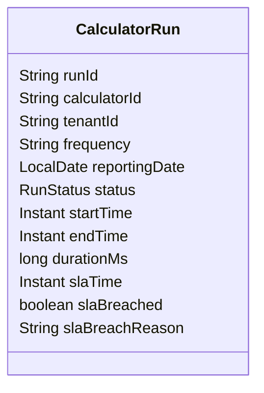
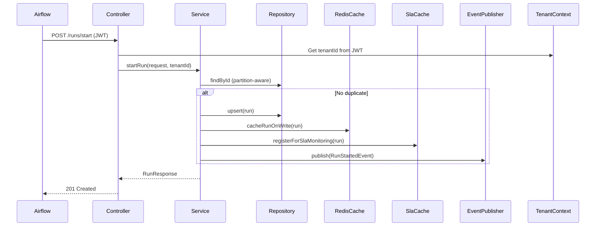
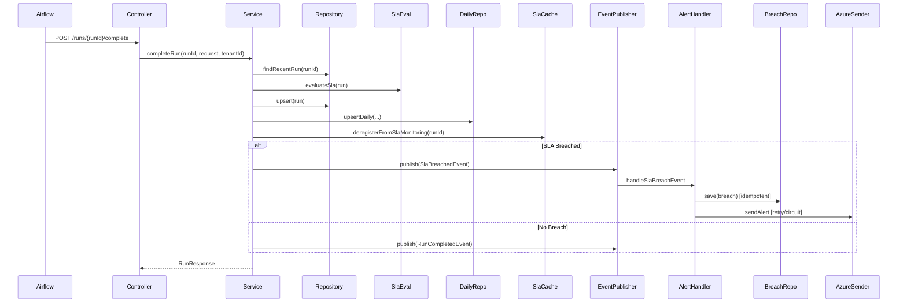
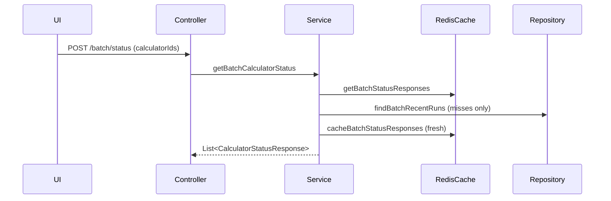

# Observability Service Technical Specification

## Overview
The Observability Service is a backend application designed to monitor and track "calculator runs" – computational processes with defined frequencies (DAILY or MONTHLY), SLAs, and performance metrics. It supports:
- **Ingestion**: Recording start and completion of runs from external systems (e.g., Airflow, Calculators).
- **Querying**: Retrieving status, history, and analytics for calculators.
- **SLA Monitoring**: Detecting breaches and alerting via Azure Monitor.
- **Optimization**: Heavy use of Redis for caching to reduce PostgreSQL load, with write-through and read-through patterns.
- **Security**: JWT-based authentication with Azure AD, role-based access control (RBAC).
- **Scalability**: Partitioned PostgreSQL tables, asynchronous processing, and resilience patterns.

The service is built with Spring Boot, PostgreSQL (partitioned for performance), Redis (for caching and live monitoring), and integrates with OpenTelemetry for observability.

### Key Features
- Partitioned storage for calculator runs by reporting date.
- Intelligent caching with TTLs based on run status and frequency.
- Live SLA breach detection using Redis sorted sets.
- Batch querying for dashboards with cache batching.
- Event-driven architecture for cache eviction, warming, and alerting.
- Metrics export to Prometheus/Azure Monitor.

### Non-Functional Requirements
- **Performance**: Handle 1000+ concurrent queries with <200ms latency (via caching).
- **Availability**: 99.9% uptime, with circuit breakers and retries for alerting.
- **Scalability**: Horizontal scaling via multiple instances; Redis cluster support.
- **Security**: Tenant isolation via JWT claims; no header-based tenant spoofing.
- **Data Retention**: DAILY runs: 7 days; MONTHLY: 13 months (via partition dropping).
- **Monitoring**: Custom Micrometer metrics; OpenTelemetry traces/metrics.

## Architecture
The service follows a layered architecture:
- **Controllers**: Handle HTTP requests, secured with Spring Security.
- **Services**: Business logic, caching, event publishing.
- **Repositories**: JDBC-based for PostgreSQL; custom queries with partition awareness.
- **Caches**: Redis for write-through/read-through, bloom filters, and sorted sets.
- **Events**: Spring ApplicationEvents for async decoupling (e.g., cache eviction, alerting).
- **Configs**: Spring configurations for async, metrics, Redis, security.

### High-Level Components
- **Ingestion Flow**: Airflow → Controller → Service → Repository → Cache → Events.
- **Query Flow**: UI → Controller → Service → Cache/Repository → Response.
- **Monitoring**: Scheduled tasks for SLA detection; Redis for live tracking.

### Technology Stack
- **Language/Framework**: Java 17+, Spring Boot 3.9
- **Database**: PostgreSQL 17 (Azure Flexible Server) with partitioning.
- **Cache**: Redis 7+ with Lettuce client.
- **Security**: Spring Security with OAuth2/JWT (Azure AD).
- **Observability**: Micrometer, OpenTelemetry.
- **Resilience**: Resilience4j (circuit breaker, retry).
- **API Docs**: Springdoc OpenAPI/Swagger.

### Deployment
- Containerized (Docker/Kubernetes).
- Environment variables for configs (e.g., REDIS_HOST, POSTGRES_URL).
- Profiles: dev, prod.

## Data Models
### CalculatorRun (Core Entity)
- **Description**: Represents a single run of a calculator.
- **Fields**:
    - runId: String (PK part)
    - calculatorId: String
    - calculatorName: String
    - tenantId: String
    - frequency: String (DAILY/MONTHLY)
    - reportingDate: LocalDate (PK part, partition key)
    - startTime: Instant
    - endTime: Instant
    - durationMs: Long
    - startHourCet: BigDecimal
    - endHourCet: BigDecimal
    - status: String (RUNNING/SUCCESS/FAILED/TIMEOUT/CANCELLED)
    - slaTime: Instant
    - expectedDurationMs: Long
    - estimatedStartTime: Instant
    - estimatedEndTime: Instant
    - slaBreached: Boolean
    - slaBreachReason: String
    - runParameters: String (JSON)
    - createdAt/updatedAt: Instant



- **Enums**:
    - RunStatus, CalculatorFrequency, BreachType, AlertStatus, Severity.

### DailyAggregate
- **Description**: Pre-computed daily metrics per calculator.
- **Fields**:
    - calculatorId: String (PK)
    - tenantId: String (PK)
    - dayCet: LocalDate (PK)
    - totalRuns: Integer
    - successRuns: Integer
    - slaBreaches: Integer
    - avgDurationMs: Long
    - avgStartMinCet: Integer
    - avgEndMinCet: Integer
    - computedAt: Instant

### SlaBreachEvent
- **Description**: Records SLA breaches for alerting.
- **Fields**:
    - breachId: Long (PK)
    - runId: String (Unique)
    - calculatorId: String
    - calculatorName: String
    - tenantId: String
    - breachType: String
    - expectedValue: Long
    - actualValue: Long
    - severity: String
    - alerted: Boolean
    - alertedAt: Instant
    - alertStatus: String
    - retryCount: Integer
    - lastError: String
    - createdAt: Instant

### Database Schema
- **Partitions**: calculator_runs partitioned by RANGE on reporting_date (daily partitions).
- **Indexes**: On calculator_id, tenant_id, status, sla_time, frequency.
- **Views**: recent_daily_runs, recent_monthly_runs, active_calculator_runs.
- **Functions**: create_calculator_run_partitions(), drop_old_calculator_run_partitions(), get_partition_statistics().

## APIs
### Ingestion Endpoints (Secured: ROLE_AIRFLOW)
- **POST /api/v1/runs/start**
    - Request: StartRunRequest (runId, calculatorId, calculatorName, frequency, reportingDate, startTime, slaTimeCet, etc.)
    - Response: RunResponse (201 Created)
    - Description: Starts a run, registers in SLA monitoring.

- **POST /api/v1/runs/{runId}/complete**
    - Request: CompleteRunRequest (endTime, status)
    - Response: RunResponse
    - Description: Completes a run, evaluates SLA, updates aggregates.

### Query Endpoints (Secured: ROLE_UI_READER or ROLE_AIRFLOW)
- **GET /api/v1/calculators/{calculatorId}/status?frequency=...&historyLimit=...**
    - Response: CalculatorStatusResponse
    - Description: Single calculator status with history.

- **POST /api/v1/calculators/batch/status?frequency=...&historyLimit=...&allowStale=...**
    - Request: List<String> calculatorIds
    - Response: List<CalculatorStatusResponse>
    - Description: Batch status for dashboards.

### Health Endpoint
- **GET /api/v1/health**: Returns UP status.

## Flows and Diagrams
### Ingestion Flow: Start Run
1. Airflow calls POST /start.
2. Controller extracts tenant from JWT.
3. Service checks for duplicates, builds CalculatorRun, saves to DB.
4. Cache write-through to Redis sorted set.
5. Register in SLA monitoring (Redis ZSET).
6. Publish RunStartedEvent → Cache eviction.

#### Sequence Diagram (Mermaid)


### Ingestion Flow: Complete Run
1. Airflow calls POST /complete.
2. Service finds run (recent partitions first).
3. Updates run, evaluates SLA.
4. Saves to DB, updates daily aggregate.
5. Deregister from SLA monitoring.
6. If breached: Publish SlaBreachedEvent → AlertHandler.
7. Else: Publish RunCompletedEvent → Cache eviction/warming.

#### Sequence Diagram (Mermaid)


### Query Flow: Get Status
1. UI calls GET /status.
2. Service checks Redis response cache.
3. On miss: Query DB with partition pruning (frequency-based views).
4. Build response, cache it.

#### Flow Diagram (Mermaid)
```mermaid
flowchart TD
    A[UI Request] --> B[Controller]
    B --> C[Service: getCalculatorStatus]
    C --> D{Redis Hit?}
    D -- Yes --> E[Return Cached Response]
    D -- No --> F[Repository: findRecentRuns (partitioned)]
    F --> G[Build Response]
    G --> H[Cache Response in Redis]
    H --> I[Return Response]
```

### Query Flow: Batch Status
Similar to single, but with batch cache gets/sets and batch DB queries.

#### Sequence Diagram (Mermaid)


### SLA Monitoring Flow
- Scheduled: Every 2 min, check Redis ZSET for breached runs.
- Get breached/approaching runs → Publish events → Alert.

#### Flow Diagram (Mermaid)
```mermaid
flowchart TD
    A[Scheduled Task] --> B[SlaMonitoringCache: getBreachedRuns]
    B --> C[For each: Publish SlaBreachedEvent]
    C --> D[AlertHandler: Handle Event]
    D --> E[Save Breach (idempotent)]
    E --> F[Send Alert (retry/circuit)]
    subgraph Early Warning
        G[Scheduled Task] --> H[getApproachingSlaRuns]
        H --> I[Publish Warnings]
    end
```

### Caching Flow
- **Write-Through**: On DB write, update Redis sorted set (recent runs), track running.
- **Read-Through**: Check Redis first; on miss, query DB, cache response.
- **Eviction**: On events (start/complete/breach), evict response cache.
- **Warming**: On complete, proactively query and cache recent runs.
- **Batch**: Pipelined Redis operations.
- **TTL**: Dynamic based on status (short for RUNNING, longer for completed).
- **Bloom Filter**: Quick existence checks.

#### Flow Diagram (Mermaid)
```mermaid
flowchart TD
    A[DB Write] --> B[Cache Write-Through (ZSET)]
    C[Query] --> D{Response Cache Hit?}
    D -- Yes --> E[Return]
    D -- No --> F[Recent Runs ZSET Hit?]
    F -- Yes --> G[Build Response]
    F -- No --> H[DB Query]
    H --> I[Cache Recent Runs]
    I --> G
    G --> J[Cache Full Response]
    J --> E
```

## Caching Strategy
- **Prefixes**: obs:runs:zset:, obs:status:, obs:running, obs:active:bloom.
- **Structures**:
    - Sorted Set: Recent runs (score: timestamp), TTL dynamic.
    - Value: Full responses, TTL 30-60s.
    - Set: Running calculators.
    - Bloom: Existence checks.
- **SLA Monitoring**: ZSET (score: SLA deadline), Hash for info.
- **Eviction**: Explicit on changes.
- **Batch**: Pipelined for performance.

## Security
- **Auth**: JWT from Azure AD; claims for roles (AIRFLOW, UI_READER, ADMIN) and tenant_id.
- **Tenant Isolation**: Extract tenant from JWT claim, not headers.
- **CORS**: Allowed for UI domains.
- **RBAC**: @PreAuthorize on methods.

## Monitoring and Metrics
- **Custom Metrics**: calculator.runs.active, sla.breaches.created, cache.evictions, etc.
- **Export**: Prometheus endpoint.
- **Tracing**: OpenTelemetry for spans (e.g., alert sending).
- **Logging**: Structured with requestId.

## Operational Aspects
- **Scheduling**: Partition creation daily; SLA checks every 2-3 min.
- **Resilience**: Retry/circuit for alerting.
- **Migration**: Flyway for schema.
- **Config**: YAML with env vars.

## Implementation Guidelines
- Follow codebase patterns (e.g., Lombok, Optional for nulls).
- Test: Unit (services), Integration (DB/Redis), Load (queries).
- Deploy: CI/CD with env-specific profiles.
- Future: Add more analytics endpoints using daily aggregates.