# Observability Service Technical Specification

## Overview
The Observability Service is a backend application designed to monitor and track "calculator runs" – computational processes with defined frequencies (DAILY or MONTHLY), SLAs, and performance metrics. It supports:
- **Ingestion**: Recording start and completion of runs from external systems (e.g., Airflow, Calculators).
- **Querying**: Retrieving status, history, and analytics for calculators.
- **SLA Monitoring**: Detecting breaches and alerting via Azure Monitor.
- **Optimization**: Heavy use of Redis for caching to reduce PostgreSQL load, with write-through and read-through patterns.
- **Security**: JWT-based authentication with Azure AD, role-based access control (RBAC).
- **Scalability**: Partitioned PostgreSQL tables, asynchronous processing, and resilience patterns.

The service is built with Spring Boot, PostgreSQL (partitioned for performance), Redis (for caching and live monitoring), and integrates with OpenTelemetry for observability.

### Key Features
- Well-defined Open API json contract for all interaction points (system agnostic)
- Partitioned storage for calculator runs by reporting date.
- Intelligent caching with TTLs based on run status and frequency.
- Live SLA breach detection using Redis sorted sets.
- Batch querying for dashboards with cache batching.
- Event-driven architecture for cache eviction, warming, and alerting.
- Metrics export to Prometheus/Azure Monitor.

### Non-Functional Requirements
- **Performance**: Handle 1000+ concurrent queries with <200ms latency (via caching).
- **Availability**: 99.9% uptime, with circuit breakers and retries for alerting.
- **Scalability**: Horizontal scaling via multiple instances; Redis cluster support.
- **Security**: Tenant isolation via JWT claims; no header-based tenant spoofing.
- **Data Retention**: DAILY runs: 7 days; MONTHLY: 13 months (via partition dropping).
- **Monitoring**: Custom Micrometer metrics; OpenTelemetry traces/metrics.

## Architecture
The service follows a layered architecture:
- **Controllers**: Handle HTTP requests, secured with Spring Security.
- **Services**: Business logic, caching, event publishing.
- **Repositories**: JDBC-based for PostgreSQL; custom queries with partition awareness.
- **Caches**: Redis for write-through/read-through, bloom filters, and sorted sets.
- **Events**: Spring ApplicationEvents for async decoupling (e.g., cache eviction, alerting).
- **Configs**: Spring configurations for async, metrics, Redis, security.

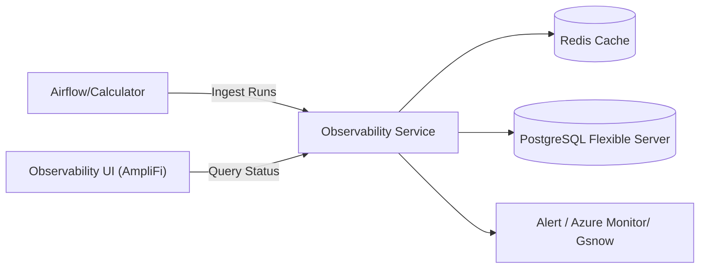

### High-Level Components
- **Ingestion Flow**: Airflow → Controller → Service → Repository → Cache → Events.
- **Query Flow**: UI → Controller → Service → Cache/Repository → Response.
- **Monitoring**: Scheduled tasks for SLA detection; Redis for live tracking.

### Technology Stack
- **Language/Framework**: Java 17+, Spring Boot 3.9
- **Database**: PostgreSQL 17 (Azure Flexible Server) with partitioning.
- **Cache**: Redis 7+ with Lettuce client.
- **Security**: Spring Security with OAuth2/JWT (Azure AD).
- **Observability**: Micrometer, OpenTelemetry.
- **Resilience**: Resilience4j (circuit breaker, retry).
- **API Docs**: Springdoc OpenAPI/Swagger.

### Deployment
- Containerized (Docker/Kubernetes).
- Environment variables for configs (e.g., REDIS_HOST, POSTGRES_URL).
- Profiles: dev, prod.

## Data Models
### CalculatorRun (Core Entity)
- **Description**: Represents a single run of a calculator.

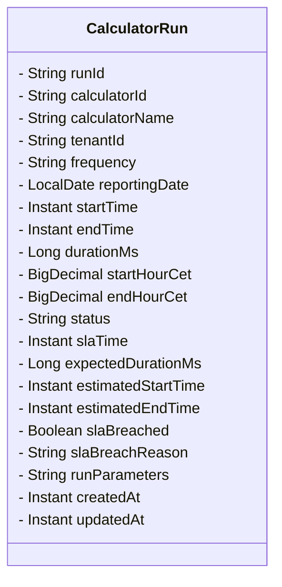
- **Table**:
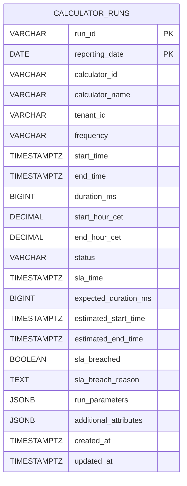
### Database Schema
- **Partitions**: calculator_runs partitioned by RANGE on reporting_date.
- **Indexes**: On Key Columns.
- **Views**: aggregated views
- **Functions**: create_calculator_run_partitions(), drop_old_calculator_run_partitions().

### DailyAggregate
- **Description**: Pre-computed daily metrics per calculator.
- **Fields**:
    - calculatorId: String (PK)
    - tenantId: String (PK)
    - dayCet: LocalDate (PK)
    - totalRuns: Integer
    - successRuns: Integer
    - slaBreaches: Integer
    - avgDurationMs: Long
    - avgStartMinCet: Integer
    - avgEndMinCet: Integer
    - computedAt: Instant

### SlaBreachEvent
- **Description**: Records SLA breaches for alerting.
- **Fields**:
    - breachId: Long (PK)
    - runId: String (Unique)
    - calculatorId: String
    - calculatorName: String
    - tenantId: String
    - breachType: String
    - expectedValue: Long
    - actualValue: Long
    - severity: String
    - alerted: Boolean
    - alertedAt: Instant
    - alertStatus: String
    - retryCount: Integer
    - lastError: String
    - createdAt: Instant

---
## APIs
### Ingestion Endpoints (Secured: RBAC role controlled)

- **POST `/api/v1/runs/start`**
    - Request: StartRunRequest (runId, calculatorId, calculatorName, frequency, reportingDate, startTime, slaTimeCet, etc.)
    - Response: RunResponse (201 Created)
    - Description: Starts a run, registers in SLA monitoring.

**Request Object**
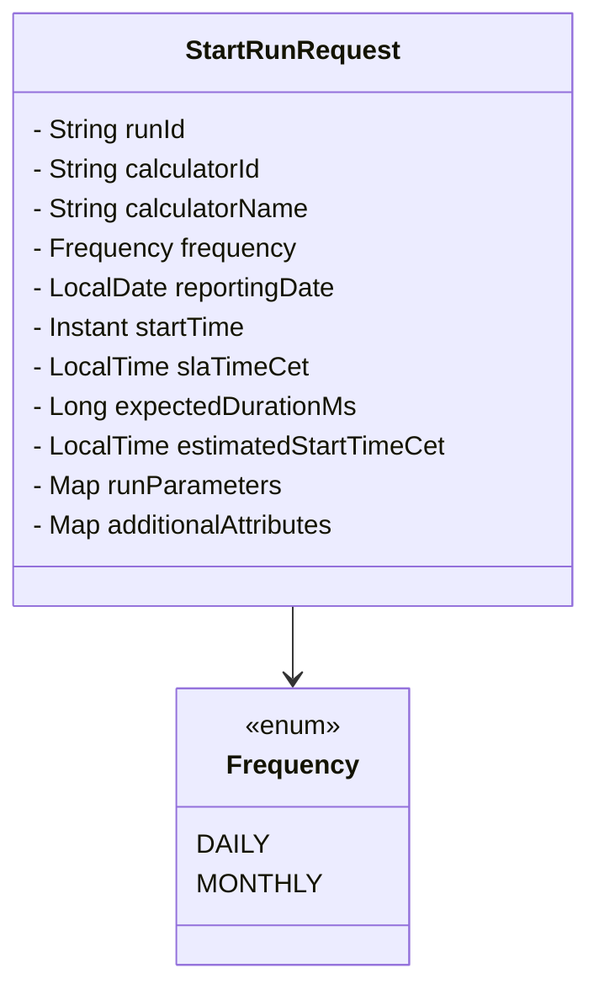
---

- **POST `/api/v1/runs/{runId}/complete`**
    - Content-Type: application/json
    - Request: CompleteRunRequest (endTime, status)
    - Response: RunResponse
    - Description: Completes a run, evaluates SLA, updates aggregates.

---

### Query Endpoints (Secured: RBAC Roles)

- **GET `/api/v1/calculators/{calculatorId}/status?frequency=...&historyLimit=...`**
    - Response: CalculatorStatusResponse
    - Description: Single calculator status with history.

- **POST `/api/v1/calculators/batch/status`**
    - Content-Type: application/json
    - Request: List<String> calculatorIds, String frequency, Integer historyLimit, Boolean allowStale
    - Response: List<CalculatorStatusResponse>
    - Description: Batch status for dashboards.

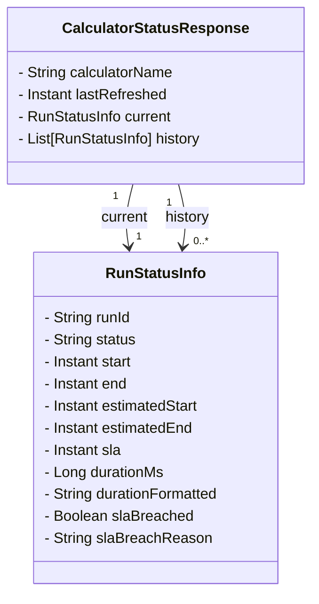

### Health Endpoint
- **GET /api/v1/health**: Returns UP status.

---

## Flows
### Ingestion Flow: Start Run

1. **Airflow / External System calls the API**
    * Sends a `POST /runs/start` request to the Controller.
2. **Controller authorizes request via Azure AD**
    * No explicit tenant extraction; request is allowed/denied based on Azure AD authentication and roles.
3. **Controller forwards request to Service**
    * Calls `startRun(request)` with the run details.
4. **Service checks for duplicates in the database**
    * Queries the Repository with `findById(runId, reportingDate)` to see if the run already exists.
5. **If no duplicate exists** (`alt No duplicate`):
    * **Service builds and saves the `CalculatorRun`** to the database (`upsert`).
    * **Service writes the run to Redis cache** (write-through), which also handles **SLA registration**.
    * **Service publishes `RunStartedEvent`** for downstream consumers.
6. **Service returns `RunResponse` to Controller**
    * Contains status and details of the newly started run.
7. **Controller responds to Airflow / External System**
    * Returns HTTP `201 Created` with the run details.

#### Sequence Diagram

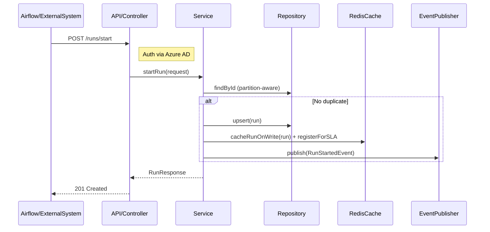

### Ingestion Flow: Complete Run

1. **Airflow / External System calls POST /complete**
    * Sends a `POST /runs/{runId}/complete` request to the Controller.
2. **Controller authorizes request via Azure AD**
    * No tenant extraction; Azure AD ensures the caller is allowed.
3. **Service finds the run**
    * Queries `Repository` with `findRecentRun(runId)` (recent partitions first).
4. **Service updates run and evaluates SLA**
    * Updates run status, end time, and any other relevant fields.
    * Calculates whether the SLA is breached.
5. **Service saves run to Repository**
    * All database persistence happens via `Repository`.
6. **Service updates Redis cache and deregisters from SLA monitoring**
    * Single RedisCache handles both caching and SLA tracking.
7. **Branch based on SLA result**:
    * **If SLA breached**:
        * Publish `SlaBreachedEvent` via EventPublisher.
        * Event handled by `AlertHandler` → saves breach record (idempotent) and sends alerts (with retry/circuit logic).
    * **Else (no breach)**:
        * Publish `RunCompletedEvent` → triggers cache eviction or warming downstream.
8. **Service returns RunResponse to Controller**
9. **Controller responds to Airflow / External System**
    * Returns HTTP `200 OK`.

#### Sequence Diagram

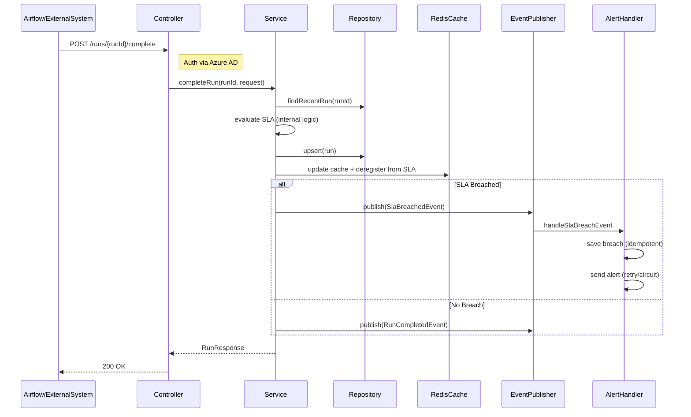

---
### Query Flow: Get Status
1. UI calls GET /status.
2. Service checks Redis response cache.
3. On miss: Query DB with partition pruning
4. Build response, cache it.

#### Flow Diagram

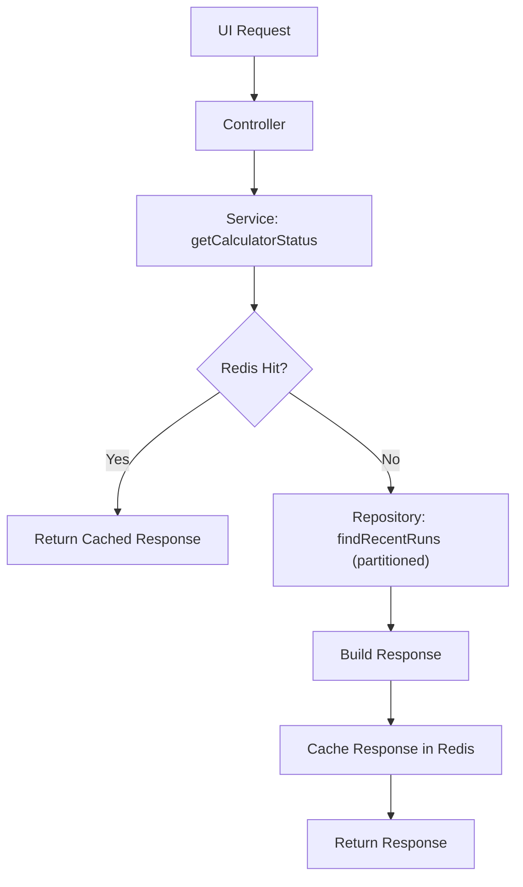

### Query Flow: Batch Status (multiple calculators)
Similar to single, but with batch cache gets/sets and batch DB queries.

#### Sequence Diagram

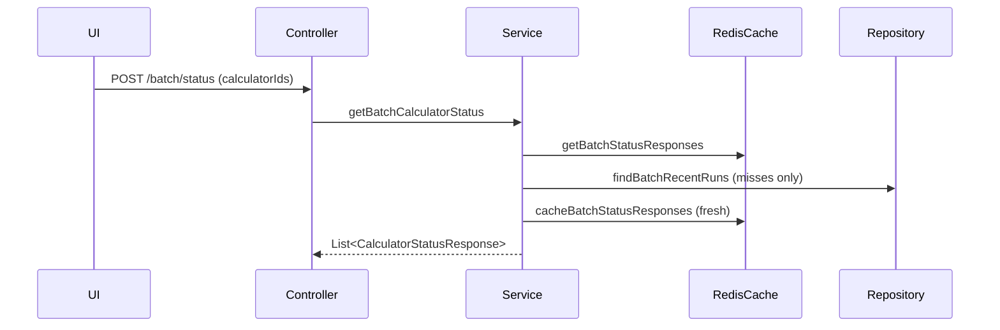

## SLA Monitoring
- Scheduled: Every 2 min, check Redis ZSET for breached runs.
- Get breached/approaching runs → Publish events → Alert.

### Flow Diagram

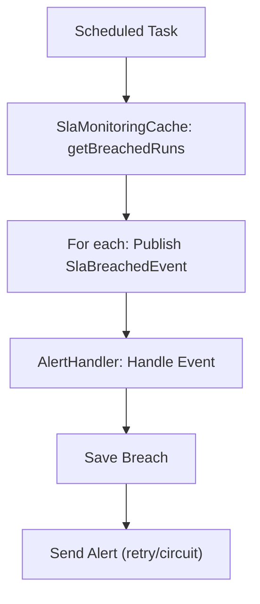
### Run Lifecycle State Machine
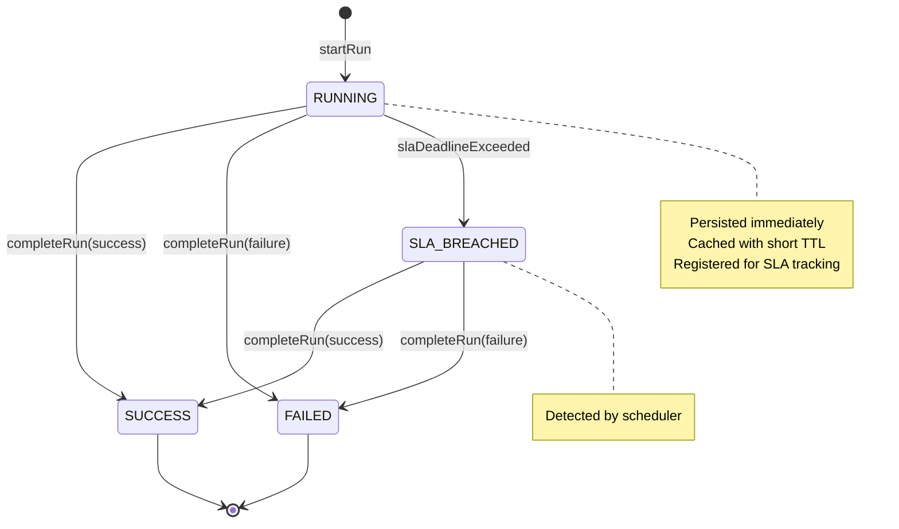

### Caching Flow
- **Write-Through**: On DB write, update Redis sorted set (recent runs), track running.
- **Read-Through**: Check Redis first; on miss, query DB, cache response.
- **Eviction**: On events (start/complete/breach), evict response cache.
- **Warming**: On complete, proactively query and cache recent runs.
- **Batch**: Pipelined Redis operations.
- **TTL**: Dynamic based on status (short for RUNNING, longer for completed).
- **Bloom Filter**: Quick existence checks.

#### Flow Diagram
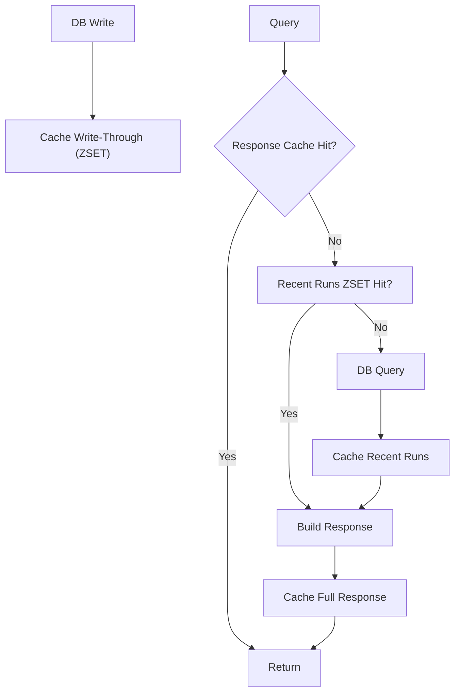

## Caching Strategy

- **Structures**:
    - Sorted Set: Recent runs (score: timestamp), TTL dynamic.
    - Value: Full responses, TTL 30-60s.
    - Set: Running calculators.
    - Bloom: Existence checks.
- **SLA Monitoring**: ZSET (score: SLA deadline), Hash for info.
- **Eviction**: Explicit on changes.
- **Batch**: Pipelined for performance.

### Key Design

| Key                           | Type | Purpose                       |
| ----------------------------- | ---- | ----------------------------- |
| obs:runs:zset:{calc}:{tenant} | ZSET | Recent runs (time-ordered)    |
| obs:status:{calc}:{tenant}    | KV   | Full status response          |
| obs:running                   | SET  | Currently running calculators |
| obs:active:bloom              | SET  | Existence filter              |
| obs:sla:deadlines             | ZSET | SLA deadlines                 |
| obs:sla:run_info              | HASH | Minimal run metadata          |

## Breach Detection
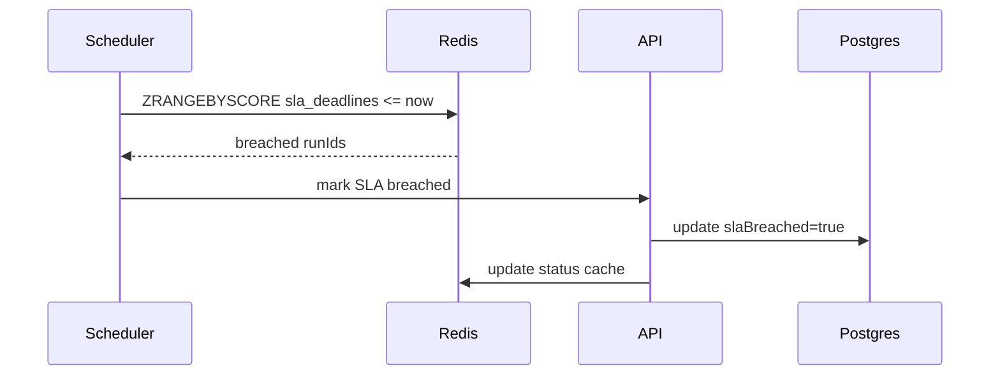

## Security
- **Auth**: Support both password and AAD RBAC

## General Guidelines:
- **Tracing**: OpenTelemetry (Azure Logging).
- **Logging**
- **Scheduling**: Partition creation
- **Resilience**: Exponential backoff Retry/circuit for alerting
- **Migration**: Flyway for schema
- Follow codebase patterns (e.g., Lombok, Optional for nulls).

