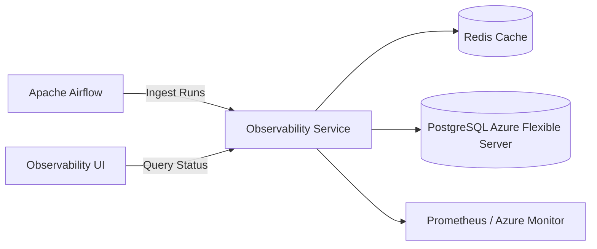
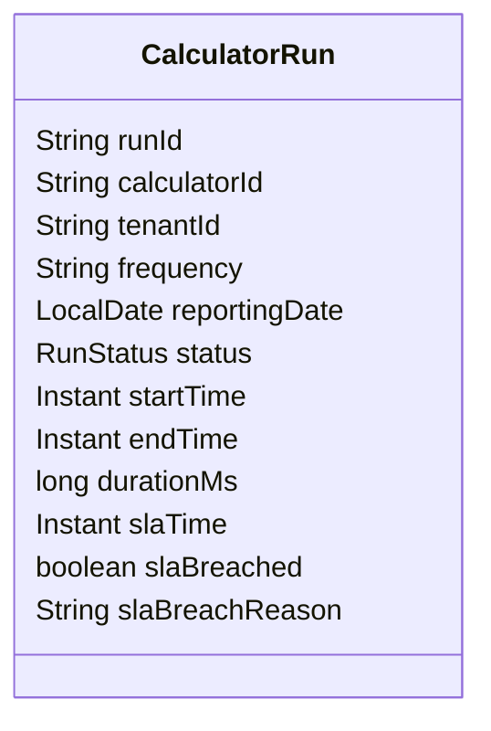
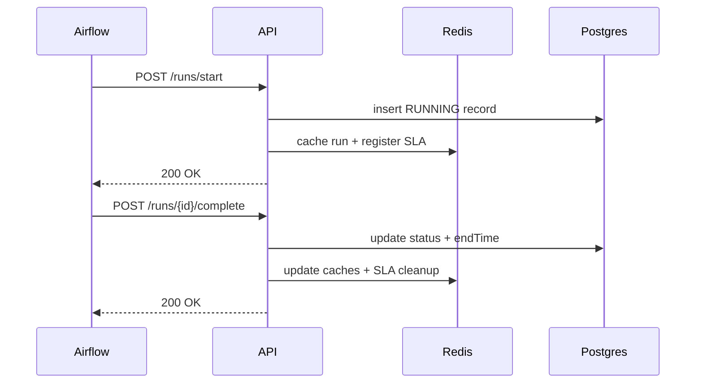
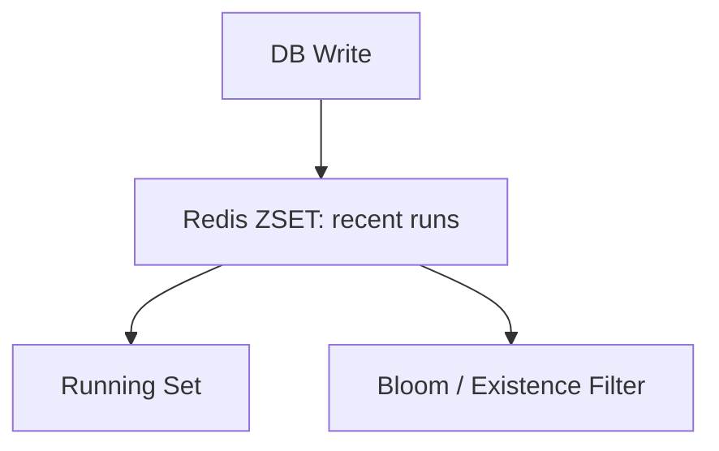
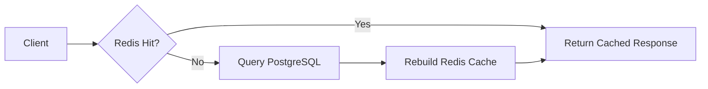
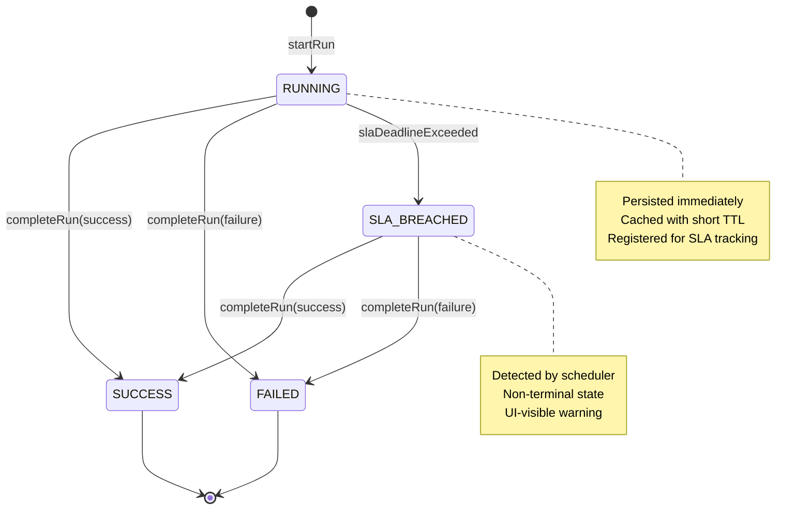
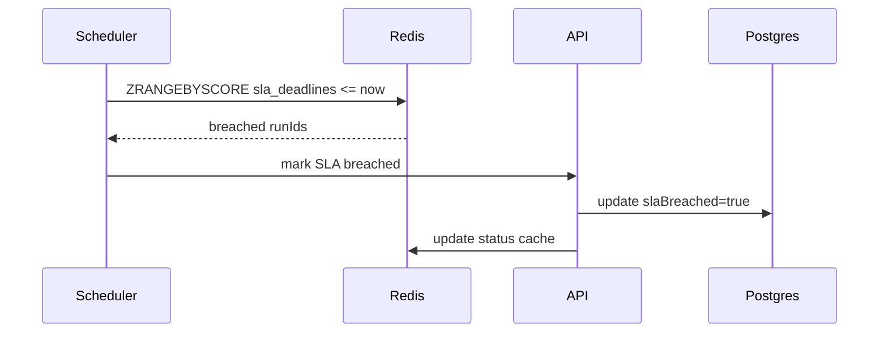

> **“Observability Service – Technical Specification”**

---


### 1. Clear System Purpose & Non-Goals

* What this service **is** and **is not**
* Explicit boundaries vs Airflow, calculators, UI
* Why Redis + Postgres + Spring Cache is used

### 2. Architecture Overview

* High-level component diagram (textual, Mermaid-ready)
* Logical layers:

    * API
    * Domain
    * Persistence
    * Cache
    * Observability & Ops
* Azure-first assumptions (AKS, Azure Postgres Flexible, Redis)

### 3. Domain Model (Very Detailed)

* CalculatorRun
* SLA metadata
* Runtime parameters
* Status transitions
* Idempotency and correlation IDs
* Strong consistency vs eventual consistency decisions

### 4. Database Design (PostgreSQL)

* Tables
* Index strategy
* Partitioning recommendations (time-based)
* Read vs write path optimization
* Why certain fields are indexed and others are not

### 5. Redis & Caching Strategy (This is a highlight)

* Cache-aside pattern
* Key design
* TTL strategy
* Negative caching
* Stampede protection
* Cache invalidation rules
* Spring Cache annotations vs programmatic RedisTemplate

### 6. Ingestion Flow (End-to-End)

* REST ingestion endpoint
* Validation
* Idempotency handling
* Cache write-through vs write-behind rationale
* Failure modes

**Includes a full sequence diagram**

### 7. Query Flow (End-to-End)

* Read path from API → Redis → DB
* Fallback logic
* Partial cache hits
* Pagination & filtering
* SLA queries vs run queries

**Includes a full sequence diagram**

### 8. API Contracts

* Endpoint list
* Request/response models
* Error semantics
* HTTP status usage
* Backward compatibility rules

### 9. Concurrency, HA & Scaling

* Read/write characteristics
* Horizontal scaling on AKS
* Redis cluster considerations
* Postgres connection pooling
* Hot-key mitigation

### 10. Security

* Azure AD integration assumptions
* AuthN/AuthZ boundaries
* PII considerations
* Audit logging

### 11. Observability *of the Observability Service*

* Metrics to expose
* Tracing strategy
* Logging standards
* Cache hit/miss KPIs
* SLA breach detection

### 12. Failure Scenarios & Recovery

* Redis outage
* Postgres failover
* Partial writes
* Duplicate ingestion
* Clock skew

### 13. Extension & Roadmap Section

* Async ingestion via events
* CDC / streaming
* Multi-region reads
* Cold storage strategy

---

# Observability Backend Service – Technical Specification

## 1. Purpose & Scope

This document describes the **Observability Backend Service** responsible for ingesting, storing, caching, and serving calculator runtime observability data (status, history, SLA, metrics). It is intended as a **handoff-ready technical specification** for backend developers.

The system is designed for:

* High read throughput (UI polling every ~60s)
* Low-latency dashboard queries
* Strong tenant isolation
* SLA monitoring and alert readiness
* Cloud-native, horizontally scalable deployment on AKS

---

## 2. High-Level Architecture

### 2.1 System Context Diagram



### 2.1 System Context

**Producers**

* Apache Airflow (calculator orchestration)

**Consumers**

* Internal Observability UI
* Analytics services

**Core Components**

* Spring Boot REST API
* PostgreSQL (Azure Flexible Server)
* Redis (cache + real-time structures)
* Azure AD (OAuth2 / JWT)
* Micrometer + Prometheus

```
Airflow ---> Ingestion API ---> PostgreSQL
                |                    |
                v                    v
              Redis <--- Query API <--- UI
```

---

## 3. Domain Model

### 3.1 CalculatorRun (Core Entity)



| Field               | Description                          |
| ------------------- | ------------------------------------ |
| runId               | Unique run identifier                |
| calculatorId        | Logical calculator identifier        |
| tenantId            | Tenant isolation key                 |
| frequency           | DAILY / MONTHLY                      |
| reportingDate       | Partition key for PostgreSQL         |
| status              | RUNNING / SUCCESS / FAILED / TIMEOUT |
| startTime / endTime | Runtime timestamps                   |
| durationMs          | Derived runtime                      |
| slaTime             | SLA deadline                         |
| slaBreached         | Boolean flag                         |
| slaBreachReason     | Enum-based reason                    |

**Partitioning Strategy**

* PostgreSQL tables are partitioned by `reporting_date`
* Enables partition pruning for fast historical queries

---

## 4. API Design

### 4.1 Ingestion APIs (Airflow-only)

#### Ingestion Sequence Diagram



#### Start Run

`POST /api/v1/runs/start`

Flow:

1. JWT validated (ROLE_AIRFLOW)
2. Tenant resolved from token
3. CalculatorRun persisted with status=RUNNING
4. Redis write-through caching
5. SLA monitoring registration

#### Complete Run

`POST /api/v1/runs/{runId}/complete`

Flow:

1. Update status + endTime
2. SLA breach evaluation
3. Redis cache updates + evictions
4. SLA deregistration

---

### 4.2 Query APIs (UI + Airflow)

#### Get Calculator Status

`GET /api/v1/calculators/{calculatorId}/status`

Returns:

* Current run (if running)
* Last N historical runs

Caching:

* Redis full-response cache (30–60s TTL)
* HTTP Cache-Control headers

#### Batch Status

`POST /api/v1/calculators/batch/status`

Optimizations:

* Redis multi-get pipelining
* Partial cache hits allowed
* Aggressive caching for dashboards

---

## 5. Redis Design

### 5.1 Key Structures

| Key                           | Type | Purpose                       |
| ----------------------------- | ---- | ----------------------------- |
| obs:runs:zset:{calc}:{tenant} | ZSET | Recent runs (time-ordered)    |
| obs:status:{calc}:{tenant}    | KV   | Full status response          |
| obs:running                   | SET  | Currently running calculators |
| obs:active:bloom              | SET  | Existence filter              |
| obs:sla:deadlines             | ZSET | SLA deadlines                 |
| obs:sla:run_info              | HASH | Minimal run metadata          |

---

### 5.2 Write-Through Cache Flow



```
DB WRITE
   |
   v
Redis ZSET (recent runs)
   |
   +--> Running Set
   +--> Bloom Filter
```

TTL Strategy:

* RUNNING: 5 min
* Recently completed: 15 min
* Stable MONTHLY: 4 hrs

---

### 5.3 Read Path (Status Query)



```
Client
  |
  v
Redis Status Cache?
  | HIT           | MISS
  v               v
Return         Query DB
                   |
                   v
              Rebuild + Cache
```

---

## 6. SLA Monitoring

### 6.0 Run Lifecycle State Machine



### 6.1 Registration

* On RUNNING start
* Only if slaTime present

### 6.2 Data Structures

* ZSET score = SLA deadline epoch millis
* HASH value = minimal run JSON

### 6.3 Breach Detection



```
Scheduled Job
   |
   v
ZSET rangeByScore <= now
   |
   v
Fetch run_info
```

Supports:

* Breached runs
* Approaching SLA (N minutes)
* Next SLA deadline

---

## 7. Caching Layers

### 7.1 Spring Cache

| Cache                 | TTL    |
| --------------------- | ------ |
| calculatorStatus      | 5 min  |
| batchCalculatorStatus | 3 min  |
| recentRuns:DAILY      | 15 min |
| recentRuns:MONTHLY    | 1 hr   |
| historicalStats       | 12 hr  |

---

## 8. Security Model

### 8.1 Authentication

* Azure AD OAuth2 Resource Server
* JWT validation via issuer-uri

### 8.2 Authorization

| Endpoint        | Role               |
| --------------- | ------------------ |
| /runs/**        | AIRFLOW            |
| /calculators/** | UI_READER, AIRFLOW |
| /actuator/**    | ADMIN              |

### 8.3 Tenant Isolation

* Tenant ID extracted from JWT
* No tenant passed via headers

---

## 9. Observability & Metrics

### 9.1 Metrics

* api.runs.start.requests
* api.runs.complete.requests
* api.calculators.status.requests
* calculator.runs.active (Gauge)

### 9.2 Tracing

* OpenTelemetry compatible
* Async executor propagation safe

---

## 10. Async & Performance

* Async executor for non-blocking operations
* Redis pipelining for batch queries
* Partition-pruned SQL queries
* Cache-first read strategy

---

## 11. Failure Handling

| Component | Strategy                |
| --------- | ----------------------- |
| Redis     | Fail-open (DB fallback) |
| Cache     | Non-fatal exceptions    |
| SLA Cache | TTL safety (24h)        |

---

## 12. Deployment & Scaling

* Stateless Spring Boot pods
* Horizontal Pod Autoscaling
* Redis as shared cache
* PostgreSQL read-optimized

---

## 13. Future Enhancements

* Alerting pipeline (email / webhook)
* Materialized views for analytics
* Redis Bloom filter (true probabilistic)
* Read replicas for PostgreSQL

---

**End of Specification**


